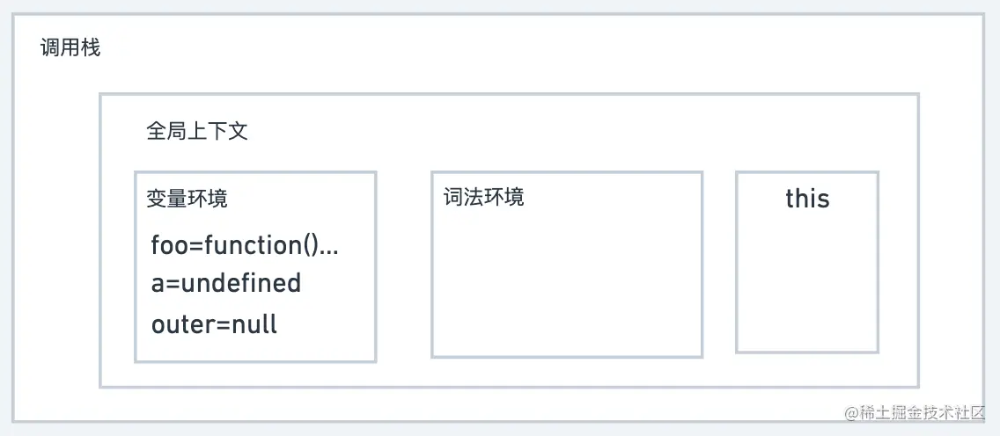

# JS运行9大概念

## 记住这张图


## 解释这张图

* 首先，我打算对这张图中要表达的内容做一个综述，然后再分别举例解释上述概念。
* 一段JS代码的执行分为编译阶段和执行阶段。
* 在编译阶段中，代码经过编译会生成两部分内容：执行上下文和可执行代码。
* 执行上下文是JS代码的执行环境，多个执行上下文将被依次压入一个栈结构，这个栈结构称作调用栈。
* 执行上下文中包含三部分：变量环境、词法环境和this变量。
* 变量环境是一个对象，保存var变量和function函数声明。
* 词法环境也是一个栈结构，栈成员是一个对象，保存let和const变量。
* 在上下文内部，变量访问总是从词法环境的栈顶开始，从栈顶到栈底，然后到变量环境。
* 在上下文之间，通过outer变量访问下一级上下文，直到全局上下文结束。
* 这个变量访问顺序就是作用域链。this不参与作用域链查询，它的值取决于四种赋值过程。
* 上下文之间偶尔会插入一个闭包，闭包通常跟楼上的函数上下文一起入栈，它不是一个上下文结构，但保存着内部函数创建时所引用的外部函数变量。

## 概念1：变量提升

```javascript
foo()
function foo() {
  console.log('foo')
}

console.log(a)
var a = 1

/* 执行结果
foo
undefined
*/
```

* 变量提升是指JS会将var变量声明和function函数声明提升至代码开头的行为，原理如下：
* JS代码执行分为编译阶段和执行阶段。编译阶段中，JS引擎会创建上下文并读取var变量声明和function函数声明保存至变量环境。在执行阶段，JS引擎会访问变量环境，执行代码。
* 对照原理图，我们可以发现，变量提升的核心原因就是JS执行分为两个阶段以及提前将变量存入了变量环境。
* 案例中的代码可以分别声明部分和执行部分，这两部分是在不同阶段执行的。

```js
// 声明部分
function foo() {
  console.log('foo')
}
var a = undefined

// 执行部分
foo()
console.log(a)
a = 1

```



## 概念2：执行上下文

执行上下文就是JS代码的执行环境，在JS编译阶段创建，用于变量的存储和查询。JS中存在三种执行上下文：

* 全局执行上下文：编译全局代码生成全局上下文，全局上下文只有一份；
* 函数执行上下文：编译函数体内代码生成函数上下文，函数执行结束后，函数上下文会被销毁；
* eval执行上下文：使用eval函数，eval的代码也会被编译生成上下文。（一般不用）

## 概念3：调用栈

* 多个执行上下文会放在一个栈结构中进行管理，由于该结构可以表达函数的调用关系，因此被称作函数调用栈，简称调用栈。
* 在执行上下文创建好后，JS引擎会将执行上下文压入栈中，执行结束后又会弹出执行上下文。
* 调用栈是有大小的，当入栈的执行上下文超过一定数量，就会报”栈溢出“的错误。

## 概念4：作用域

作用域是变量的定义区域，等同于执行上下文。不同类型的作用域访问范围不同。ES6以前，JS只有两种作用域：

* 函数作用域：函数上下文即为函数作用域，只能在函数内部访问。
* 全局作用域：全局上下文即为全局作用域，可以在任何地方访问。

## 概念5：块状作用域

var因为变量提升不支持块状作用域，所谓块状就是一对大括号组成的区域，比如：

```javascript
//if块
if(1){}

//while块
while(1){}

//函数块
function foo(){}

//for循环块
for(let i = 0; i<100; i++){}

//单独一个块
{}
```

ES6中添加了let和const关键词来支持块状作用域。块状作用域中的变量只能在块内访问。接下来举个例子看看块状作用域的原理：

```javascript
function foo() {
  var a = 1
  {
    let a = 2
    {
      let a = 3
      console.log(a) // 3
    }
    console.log(a) // 2
  }
  console.log(a) // 1
}
foo()
```


* JS通过执行上下文中的词法环境实现块状作用域的支持，词法环境是一个栈结构，每个块状作用域形成独立空间被压入栈中。
* 在上面的例子中，函数foo里嵌套了两对大括号，每对大括号形成一个块状作用域，对应词法环境中压入了两个栈成员。
* 在上下文中，变量的访问从词法环境栈顶开始，所以第一个console访问到的是3。
* 当块状作用域中代码执行完毕后，对应变量空间将从词法环境中弹出，所以第二个console访问到的是2，第三个console访问到的是变量环境中的1。

## 概念6：作用域链

* 作用域链是不同作用域之间的变量查找顺序。
* 在上下文内部，从词法环境栈顶开始，从栈顶到栈底，再到变量环境。
* 在上下文之间，通过outer变量串联实现一级一级访问。
* 词法环境对应块作用域，函数上下文对应函数作用域，
* 全局上下文对应全局作用域，这种变量的查找顺序也就形成了作用域之间的查找链条。

## 概念7：词法作用域

* 词法作用域指代的是我们刚才描述的JS中应用的变量查找规则，所以词法作用域全称应该是词法作用域链。
* 为什么叫词法作用域呢？
  * 因为变量的查找的顺序取决于代码书写的位置，即在编译时就已经决定好了，因此词法作用域也叫静态作用域。
* 刚才我们讨论作用域链的时候提到了outer，这个outer就是词法作用域实现的关键。
* outer变量中存储了下一级要访问的上下文对象，而outer的生成则是在编译阶段随着上下文的创建而创建。
* 与词法作用域相对的还有一个动态作用域，两者在访问顺序上其实都是先内部后外部，区别在于词法作用域是在编译阶段确定的，动态作用域是在执行阶段确定的。我们举个例子：

```javascript
var a = 1

function bar() {
  console.log(a)
}

function foo() {
  var a = 2
  bar()
}

foo() // 1
```

在这个例子中，如果是词法作用域，bar函数对应的外层作用域就是全局，而如果是动态作用域，bar函数对应的外层作用域就是foo函数。所以我们可以发现，词法作用域实现的关键还是JS的分阶段执行，因为是编译阶段决定所以不可能是动态作用域，只能按照代码书写位置决定访问顺序。

## 概念8：闭包

在执行上下文之间，有时会插入一个闭包，因为根据词法作用域的规则，内部函数总是可以访问其外部函数中声明的变量，如果外部函数在返回一个内部函数后，外部函数销毁了，那怎么办呢？JS就把内部函数引用的变量保存在一块独立的内存空间中，这些变量的集合就称作闭包。如果外部函数是foo，就称作foo函数的闭包。

```js
function foo() {
  var a = 1
  function bar() {
    console.log(a)
  }
  return bar
}

foo()() // 1
```


在上面例子中，foo函数返回了bar函数，在bar函数执行的时候，foo函数已经销毁，但给bar函数留下了一个闭包对象，这个闭包背在了bar函数身上，当bar函数编译生成上下文的时候一同被加载至调用栈。

## 概念9：this

### 首先我们讨论一下为什么要有this？

```javascript
var a = 1
var obj = {
  a: 2,
  foo: function() {
    console.log(a)
  }
}
obj.foo() // 1
```

在这个例子中，根据词法作用域的规则，foo函数中访问的a是全局作用域的1，而不是obj对象中的2。不过，在java、C++这样的语言中，对象内部方法访问的变量就是对象的属性，用java举例：

```java
public class Obj {
  int a = 2;

  public void foo() {
    System.out.println(a);
  }

  public static void main(String[] args){
      new Obj().foo(); // 2
   }
}
```

因为在对象内部的方法中使用对象内部的属性是一个非常普遍的需求，但是JS的作用域机制并不支持这一点，基于这个需求，JS又搞出来另外一套this机制。this和作用域基本上没关系，属于两套独立的系统。
有了this之后，就可以通过this访问对象内部的属性：


```js
var a = 1
var obj = {
  a: 2,
  foo: function() {
    console.log(this.a)
  }
}
obj.foo() // 2
```

从原理图中，我们知道，this是和执行上下文绑定的，既然有三种执行上下文，那就有三种this。不过eval用的不多，所以重点讨论全局上下文的this和函数上下文的this。
全局上下文比较简单，非严格模式下，this始终指向window对象，严格模式下，this为undefined。
函数上下文的this就比较复杂，this的指向是在运行时决定的，即与你调用函数的方式有关系。
一般来说，函数上下文的this有四种绑定方式，以函数foo举例：

* 默认绑定：直接调用，foo()，this指向全局window或undefined（严格模式）
* 隐式绑定：点调用，obj.foo()，this指向点前面的对象，上面的例子就是这种情况
* 显示绑定：通过call,apply,bind三个方法绑定，如foo.call(obj)
* new绑定：在new构造函数的过程中绑定
关于this绑定规则可以参考我的另一篇文章：this绑定规则和call、apply、bind实现
这里再次强调，this和作用域是相互独立的系统，this不参与作用域链的变量查找过程。 这会导致一些问题，最经典的就是嵌套函数的this继承问题。比如咱们改改上面那个例子：

```javascript
var a = 1
var obj = {
  a: 2,
  foo: function() {
    function bar() {
      console.log(this.a)
    }
    bar()
  }
}
obj.foo() // 1
```

我们在foo函数中执行嵌套函数bar的时候，bar中的this不会继承foo函数，而是根据bar()的调用方式选择默认绑定为window对象，于是a最终打印的是全局变量1。所以，把this和作用域链区别对待是十分重要的，避免混淆。
