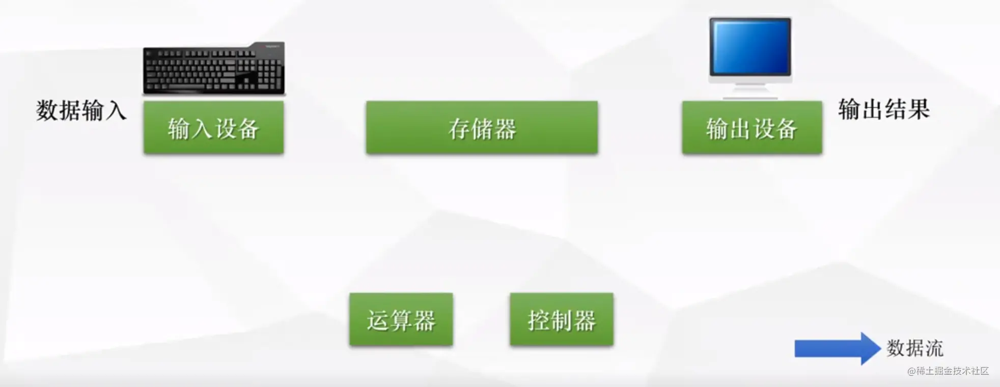
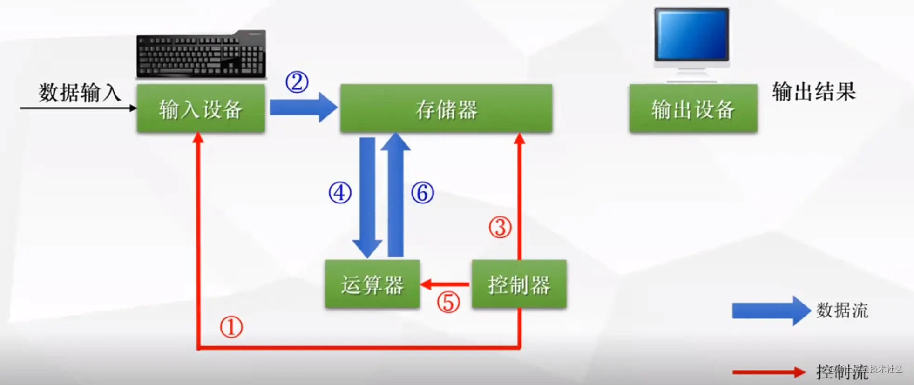
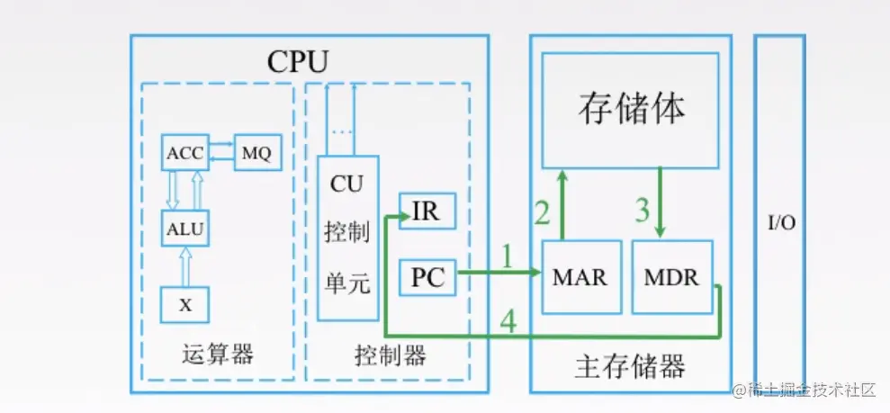
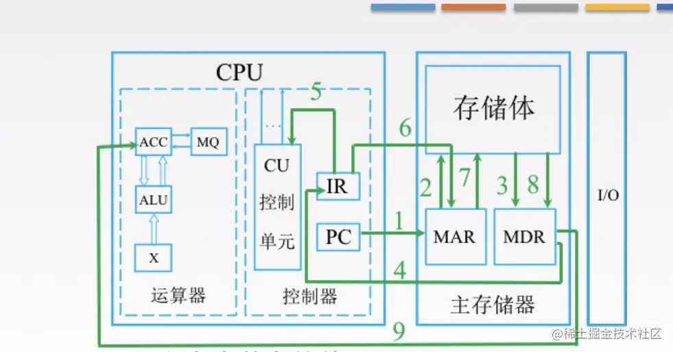
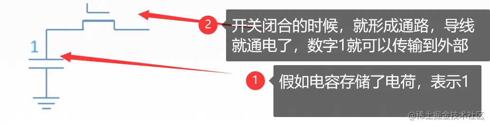
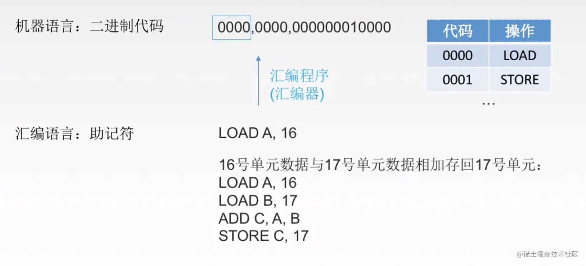
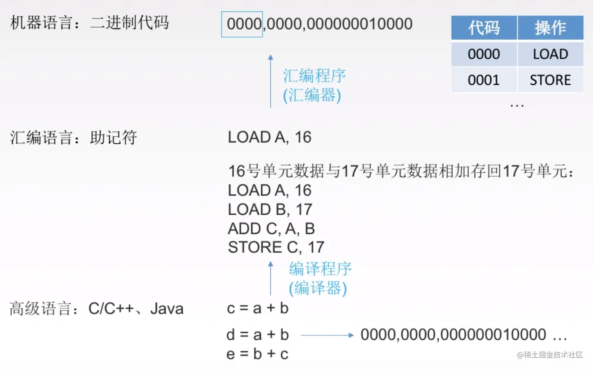
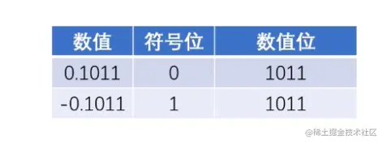
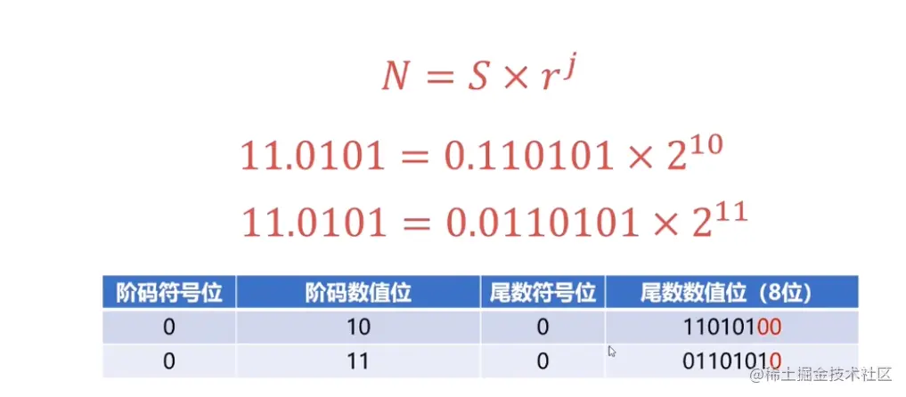

# 计算机组成原理

## 1、计算机的工作原理

首先，计算机最基本的5大组成部分如下图，分别为：输入设备(比如键盘), 存储器(比如内存), 运算器(cpu), 控制器(cpu), 输出设备(显示器)。


 我们来看二进制代码 0000，0000，000000010000 其结果为：11101 在早期的计算机里，cpu如何知道I/O设备已经完成任务呢?比如说怎么知道I/O设备已经读取完一个文件的数据呢?CPU会不断查询I/O设备是否已经准备好。这时，cpu就处于等待状态。也就是cpu工作的时候，I/O系统是不工作的，I/O系统工作，cpu是不工作。

## 工作原理如下

### 1.1 控制器 ---> 控制输入设备 ----> 指令流向内存

当我们输入数据的时候，cpu里的控制器会让输入设备把这些指令存储到存储器(内存)上。


### 1.2 控制器分析指令 ---> 控制存储器 ---> 把数据送到运算器

控制器分析指令之后， 此时让存储器把数据发送到运算器里(控制器和运算器都在cpu里面)
这里需要注意，存储器既能存储数据，还能存储指令


### 1.3 控制器控制运算器做数据的运算 并且将运算结果返回存储器



### 1.4 控制器控制存储器将结果返回给输出设备


从接下来，我们更近一步，看看计算机内部，CPU是怎么跟存储器交互的。

## 2、CPU及其工作过程

CPU中比较重要的两个部件是运算器和控制器，我们先来看看运算器的主要作用

### 2.1 运算器主要部件


如上图，运算器里最重要的部件是ALU，中文叫算术逻辑单元，用来进行算术和逻辑运算的。其它的MQ,ACC这些我们不用管了，是一些寄存器。

### 2.2 控制器主要部件


控制器中最重要的部件是CU（控制单元），只要是分析指令，给出控制信号。
IR（指令寄存器），存放当前需要执行的指令
PC存放的指令的地址。

### 2.3 举例 - 取数指令执行过程



### 首先，是取指令的过程如下



* 第一步，PC，也就是存放指令地址的地方，我们要知道下一条指令是什么，就必须去存储器拿，CPU才知道接下来做什么。PC去了存储器的MAR拿要执行的指令地址，MAR（存储器里专门存指令地址的地方）
* 第二步和第三步，MAR去存储体内拿到指令之后，将指令地址放入MDR(存储器里专门存数据的地方)
* 第四步MDR里的数据返回到IR里面，IR是存放指令的地方，我们把刚才从存储体里拿的指令放在这里
然后，分析指令，执行指令的过程如下

* 第五步， IR将指令放入CU中，来分析指令，比如说分析出是一个取数指令，接着就要执行指令了（这里取数指令，其实就是一个地址码，按着这个地址去存储体取数据）
* 第六步，第七步 IR就会接着去找存储体里的MAR（存储地址的地方），MAR就根据取数指令里的地址吗去存储体里去数据
* 第八步，取出的数据返回给MDR（存放数据的地方）
* 第九步，MDR里的数据放到运算器的寄存器里，这里的取指令的过程结束了。
来个插曲，我们知道数据在内存里是二进制存着，也就是0和1, 0和1怎么用表示呢？
我们拿其中一种存储0和1的方式来说明
* 电容是否有电荷，有电荷代表1，无电荷代表0
* 如下图



## 3、计算机编程语言

我们看看机器语言，怎么表示存放一个数的指令，例如下图


* 其中第一个0000，表示的是汇编语言里的LOAD，也就是加载，加载什么呢
* 加载地址000000010000上的数据到第二个0000（寄存器的位置）。
接下来，我们看看如果是汇编语言怎么表示


LOAD A, 16意思是将存储体内的16号单元数据，放到寄存器地址A中 ADD C, A, B意思是将寄存器里的A,B数据相加，得到C STORE C, 17意思是将寄存器里的数据存到存储体17号单元内
最后，我们看看怎么用高级语言表示


高级语言是不是很简单，就一个a+b，你都不用去考虑寄存器，存储体这些事。
这部分的总结

### 高级语言一般有两种方式转换为机器语言

* 一种是直接借助编译器，将高级语言转换为二进制代码，比如c，这样c运行起来就特别快，因为编译后是机器语言，直接就能在系统上跑，但问题是，编译的速度可能会比较慢。
* 一种是解释性的，比如 js，是将代码翻译一行成机器语言（中间可能会先翻译为汇编代码或者字节码），解释一行，执行一行
需要注意的是，按照第一种将大量的高级代码翻译为机器语言，这其中就有很大的空间给编译器做代码优化，解释性语言就很难做这种优化，但是在v8引擎中，js还是要被优化的，在编译阶段（代码分编译和执行两个阶段）会对代码做一些优化，编译后立即执行的方式通常被称为 JIT (Just In Time) Comipler。

## 4、进制转换

接下来4.3这个小节会解释为什么0.1 + 0.2 等于0.3

### 4.1 二进制如何转化为十进制

例如2进制101.1如何转化为10进制。（有些同学觉得可以用parseInt('101.1', 2)，这个是不行的，因为parseInt返回整数）
转化方法如下：


上图的规则是什么呢？
二进制的每个数去乘以2的相应次方,注意小数点后是乘以它的负相应次方。 再举一个例子你就明白了，
二进制1101转为十进制


### 4.2 十进制整数转为二进制

JS里面可以用toString(2)这个方法来转换。如果要用通用的方法，例如：将十进制数（29）转换成二进制数， 算法如下：

* 把给定的十进制数29除以2，商为14，所得的余数1是二进制数的最低位的数码
* 再将14除以2，商为7，余数为0
* 再将7除以2，商为3，余数为1，再将3除以2，商为1，余数为1
* 再将1除以2，商为0，余数为1是二进制数的最高位的数码


### 4.3 十进制小数转为二进制

方式是采用“乘2取整，顺序排列”法。具体做法是：

* 用2乘十进制小数，可以得到积，将积的整数部分取出-
* 再用2乘余下的小数部分，又得到一个积，再将积的整数部分取出-
* 如此进行，直到积中的小数部分为零，或者达到所要求的精度为止
我们具体举一个例子

### 如: 十进制 0.25 转为二进制

* 0.25 * 2 = 0.5 取出整数部分：0
* 0.5 *2 = 1.0 取出整数部分1
即十进制0.25的二进制为 0.01 ( 第一次所得到为最高位,最后一次得到为最低位)
此时我们可以试试十进制0.1和0.2如何转为二进制
0.1(十进制) = 0.0001100110011001(二进制) 十进制数0.1转二进制计算过程： 0.1*2＝0.2……0——整数部分为“0”。整数部分“0”清零后为“0”，用“0.2”接着计算。 0.2*2＝0.4……0——整数部分为“0”。整数部分“0”清零后为“0”，用“0.4”接着计算。 0.4*2＝0.8……0——整数部分为“0”。整数部分“0”清零后为“0”，用“0.8”接着计算。 0.8*2＝1.6……1——整数部分为“1”。整数部分“1”清零后为“0”，用“0.6”接着计算。 0.6*2＝1.2……1——整数部分为“1”。整数部分“1”清零后为“0”，用“0.2”接着计算。 0.2*2＝0.4……0——整数部分为“0”。整数部分“0”清零后为“0”，用“0.4”接着计算。 0.4*2＝0.8……0——整数部分为“0”。整数部分“0”清零后为“0”，用“0.8”接着计算。 0.8*2＝1.6……1——整数部分为“1”。整数部分“1”清零后为“0”，用“0.6”接着计算。 0.6*2＝1.2……1——整数部分为“1”。整数部分“1”清零后为“0”，用“0.2”接着计算。 0.2*2＝0.4……0——整数部分为“0”。整数部分“0”清零后为“0”，用“0.4”接着计算。 0.4*2＝0.8……0——整数部分为“0”。整数部分“0”清零后为“0”，用“0.2”接着计算。 0.8*2＝1.6……1——整数部分为“1”。整数部分“1”清零后为“0”，用“0.2”接着计算。 …… …… 所以，得到的整数依次是：“0”，“0”，“0”，“1”，“1”，“0”，“0”，“1”，“1”，“0”，“0”，“1”……。 由此，大家肯定能看出来，整数部分出现了无限循环。 复制代码

### 接下来看0.2

0.2化二进制是 0.2*2=0.4,整数位为0 0.4*2=0.8,整数位为0 0.8*2=1.6,整数位为1,去掉整数位得0.6 0.6*2=1.2,整数位为1,去掉整数位得0.2 0.2*2=0.4,整数位为0 0.4*2=0.8.整数位为0 就这样推下去！小数*2整,一直下去就行 这个数整不断 0.0011001 复制代码
所以0.1和0.2都无法完美转化为二进制，所以它们相加当然不是0.3了

## 5、定点数和浮点数

首先，什么是定点数呢？

### 5.1 定点数


如上图，举例纯整数的二进制1011和-1011，如果是整数，符号位用0表示，如果是负数符号为用1表示


同理，纯小数表示举例如下：


那如果不是纯小数或者纯整数，该怎么表示呢？
比如10.1, 可以乘以一个比例因子，将10.1 ---> 101 比例因子是10, 或者10.1 ---> 0.101比例因子是100
定点数很简单，接下来我们介绍浮点数，再JS里面，数字都是用双精度的浮点数，所以学习浮点数对我们理解JS的数字有帮助。

### 5.2 浮点数

浮点数怎么表示呢？


上面是十进制的科学计数法，从中我们需要了解几个概念，一个是尾数，基数和阶码

* 尾数必须是纯小数，所以上图中1.2345不满足尾数的格式，需要改成0.12345
* 基数，在二进制里面是2
* 阶码就是多少次方

### 所以浮点数的通用表示格式如下



* S代表尾数
* r代表基数
* j代表阶码
这里需要注意的是，浮点数的加减运算，并不是像我们上面介绍的那样简单，会经过以下几个步骤完成


这些名词大家感兴趣的话，可以去网上查询，我们只要了解到浮点数加减运算很麻烦就行了，但如果你要做一个浮点数运算的库，你肯定是要完全掌握的。

## 6、局部性原理和catche(缓存)

先看下图


（说明一下，MDR和MAR虽然逻辑上属于主存，但是在电路实现的时候，MDR和MAR离CPU比较近）
上图是在执行一串代码,可以理解为js的for循环

```javascript
const n = 1000;
const a = [1, 2, 3, 4, 5, 6, 7]
for(let i =0; i < n; i++) {
    a[i] = a[i] + 2
}
```

我们可以发现

* 数组的数据有时候在内存是连续存储的
* 如果我们要取数据，比如从内存取出a[0]的数据需要1000ns(ns是纳秒的意思),那么取出a[0]到a[7]就需要1000 * 8 = 8000 ns
* 如果我们cpu发现这是取数组数据，那么我就把就近的数据块a[0]到a[7]全部存到缓存上多好，这样只需要取一次数据，消耗1000ns
cahce就是局部性原理的一个应用


* 空间局部性：在最近的未来要用到的信息（指令和数据），很可能与现在正在使用的信息在存储空间上是邻近的
* 时间局部性：在最近的未来要用到的信息，很可能是现在正在使用的信息


可以看到cache一次性取了a[0]到a[9]存储体上的数据，只需要1000ns，因为Cache是高速存储器，跟cpu交互速度就比cpu跟主存交互速度快很多。
接下里，进入最后一节(略过对总线知识的学习)，I/O设备的演变

## 7、I/O设备的演变

### I/O是什么呢？

输入/输出（Input /Output ,简称I/O），指的是一切操作、程序或设备与计算机之间发生的数据传输过程。 复制代码
比如文件读写操作，就是典型的I/O操作。接下来我们看一下I/O设备的演进过程


### 接着看第二阶段


* 为了解决第一阶段CPU要等待I/O设备，串行的工作方式，所有I/O设备通过I/O总线来跟CPU打交道，一旦某个I/O设备完成任务，就会以中断请求的方式，通过I/O总线，告诉CPU，我已经准备好了。
* 但是对于高速外设，它们完成任务的速度很快，所以会频繁中断CPU, 为了解决这个问题，高速外设跟主存之间用一条直接数据通路，DMA总线连接，CPU只需要安排开始高速外设做什么，剩下的就不用管了，这样就可以防止频繁中断CPU。
最后来看一下第三阶段


### 第三阶段，CPU通过通道控制部件来管理I/O设备，CPU不需要帮它安排任务，只需要简单的发出启动和停止类似的命令，通道部件就会自动的安排相应的I/O设备工作
