# 计算机网络基础知识

## 1、计算机网络概念（简单扫一眼即可）

计算机网络：是一个将分散的、具有独立功能的计算机系统，通过通信设备与线路连接起来，由功能完善的软件实现资源共享和信息传递的系统。
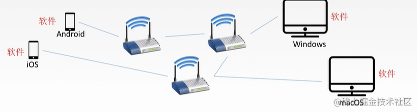

这里需要注意的是，按分布范围，计算机网络里有局域网LAN和广域网WAN, 其中局域网的代表以太网，以及这两种网络最重要的区分点，局域网基于广播技术，广域网基于分组交换技术。（这些概念听一下就行，后面会详细介绍，因为理解广播和分组交换技术，大体上就理解了局域网和广域网）

## 2、衡量计算机网络的性能的指标

这些内容主要是为了学习后面具体的协议，以及分析这些协议的报文时，需要掌握的基本概念。

### 2.1 速率

速率就是数据传输（数据是指0和1）的速率，比如你用迅雷下载，1兆每秒，来衡量目前数据传输的快慢。它是计算机网络中最重要的一个性能指标。

### 2.2 带宽

在计算机网络中，网络带宽是指在单位时间（一般指的是1秒钟）内能传输的数据量，比如说你家的电信网络是100兆比特，意思是，一秒内最大的传输速率是100兆比特。

### 2.3 吞吐量

吞吐量表示在单位时间内通过某个网络（或信道、接口）的数据量。

#### 以上三点，我们举个案例

* 一条路每秒最多能过100辆车（宽带就相当于100辆/秒）。
* 而并不是每秒都会有100辆车过，假如第一秒有0辆，第二秒有10辆...，（但是最多不能超过100辆）。
* 所以有第1秒0辆/秒，第2秒10辆/秒，第3秒30辆/秒，这不能说带宽多少吧，于是就用吞吐量表示具体时间通过的量有多少（也有可能等于带宽的量）。
* 由此可知带宽是说的是最大值速率，吞吐量说的是某时刻速率。但吞吐量不能超过最大速率。

### 2.4 时延

时延是指数据（报文/分组/比特流）从网络（或链路）的一端传送到另一端所需的时间。单位是s。 时延分一下几种：

#### （1）发送时延

就是说我跟你说话，从我开始说，到说话结束这段时间，就是发送时延。

#### （2）传播时延

如gif图所示，信道上第一个比特开始，到最后一个比特达到主机接口需要的时间就是传播时延。

#### （3）排队时延

* 分组在经过网络传输时，要经过很多的路由器。
* 但分组在进入路由器后要先在输入队列中排队等待处理。
* 在路由器确定了转发接口后，还要在输出队列中排队等待转发，这就产生了排队时延。
* 排队时延的长短往往却决于网络当时的通信量，当网络的通信量很大时会发生排队溢出，是分组丢失。

#### （4）处理时延

路由器或主机在收到数据包时，要花费一定时间进行处理，例如分析数据包的首部、进行首部差错检验，查找路由表为数据包选定准发接口，这就产生了处理时延。

#### （5）往返时间（RTT）

在计算机网络中，往返时间也是一个重要的性能指标，它表示从发送方发送数据开始，到发送方收到来自接收方的确认（接受方收到数据后便立即发送确认）总共经历的时间

#### （6）时延带宽积

是指传播时延乘以带宽

## 3、正文开始！OSI参考模型

OSI参考模型是网络互连的七层框架, 这里不详细介绍了，每一层的具体内容会在后面介绍，这里只需要有一个初步的印象。
如下图所示，1，2，3层主要是是物理链路组成的，比如光纤，路由器，集线器，主要负责的是数据通信。5，6，7层是软件控制的，比如http协议，是一种软件层面控制的协议，主要负责处理传输来的数据。

## 4、物理层

### 4.1 物理层有啥用？

对于物理层，有人会说，这不就是网线吗，比如家里连接路由器的网线，电线杆上的光纤？其实不然，物理层更多的是规定一种标准，他并不管物理介质具体是什么，比如电线杆上是光纤还是双绞线，只要你能按物理层规定的标准传输数据就行。

### 那物理层到底有哪些主要任务呢？

* 比如说，规定了电气特性，信号的电平用+10V - +15V表示二进制的0，用-10V - -15V表示二进制的1，只要条网线能表示这个特性，就不管你用什么材料了。
* 当然还有其它特性，我们不需要了解，知道物理层是规定传输媒体接口的标准即可。

### 4.2 光纤宽带上网是以什么样的形式传输数据呢？

* 首先计算机网卡传输出来的数据是电信号，光纤传输的是光脉冲信号，有光脉冲表示1，无光脉冲表示0。
* 而可见光的频率大约是10的8次方 MHz，因此光纤通信系统的带宽远远大于其它各种传输媒体的带宽
* 所以我们计算机传输数据需要先把电信号转为光信号，然后光信号快到服务器的时候，再把光信号转为电信号。

### 4.3 物理层设备中继器

### 为什么需要中继器呢？

因为再线路上传输的信号功率会逐渐衰减，衰减到一定程度时将造成信号失真，因此会导致接收错误。

中继器可以对信号进行再生和还原，增加信号的传输距离。
需要注意的是，中继器两端连接不同的网段，而不是子网。什么叫不同的网段呢，需要在网络层学习IP分类之后才能够理解这个概念，这里简单的理解为，不同的网段就是不同路由器连接的网络。

## 5、数据链路层

### 5.1 数据链路层是做什么的呢？

我们用一个小故事来举例

* 网络层是个大Boss， 负责给数据链路层这个小秘书下达任务，让小秘把5份文件给B公司，小秘呢，就找送快递物理层去做这个事
* 但物理层是个傻子，他只知道拿起文件就飞奔到B公司，中间丢没丢东西也不清楚，所以数据链路层这个小秘书必须心里有底，一共送了5个文件，并且写到了快递外层。B公司小秘在拿到傻子送到的文件时，就要看看到底有没有文件丢了，如果丢了就要让傻子回去重新拿丢到的文件。
* 从这个故事中，我们可以总结下数据链路层主要功能

### 5.2 数据链路层的主要功能

#### (1) 封装成帧 数据链路层并不是无脑转发boss的信息，她要把文件编号封装一下。封装的网络数据包，在链路层就叫数据帧

#### (2)透明传输

透明传输是指不管boss下达的任何信息，比如文件里有裁掉这个秘书的信息，秘书都要原原本本的传输。帧的数据部分可能有跟帧首部完全一样的字符，这时候就要采取一定的措施，让接受方不要被被误导，能让接收方知道哪些是帧的首部哪些是帧的数据。这个问题有没有类似js的转义字符的问题，比如字符串 div 到底是指div标签呢，还是div字符串呢？

#### (3)差错控制

差错控制是在文件送到B公司小秘书手里的时候，快递包上写着5个文件，秘书一看只有3个文件，就会让傻子重新发送有没有送到的文件。差错控制的方法有CRC循环冗余码，这个就不细讲了，我自己也不甚了解，只知道链路层的帧，会有一个FCS位留给这个码，用来判断一个帧是否出错。

#### (4)差错纠正

差错纠正是链路层知道1，2，3，4，5个文件，丢失的两个文件到底是哪两个，并且能通过重新发送没有的文件来纠正。
还有一些是故事里没有提到的数据链路层的功能，比如：

#### (5)流量控制 比如说发送方发送速度特别快，接收方接收速度特别慢，会造成传输出错

这里需要注意的是，传输层TCP也有流量控制功能，区别在于TCP是端到端的流量控制，链路层是点到点（比如一个路由器到下一个路由器）
流量控制的方法有滑动窗口协议，以及选择重传协议，这两个留在讲TCP的时候讲。接下来讲一下以太网，以太网是目前最常见的局域网技术。对于我们理解局域网比较有帮助。

## 6 以太网和无线网

以太网是一种局域网技术，其规定了访问控制方法、传输控制协议、网络拓扑结构、传输速率等，完成数据链路层和物理层的一些内容，它采用一种称作CSMA/CD的媒体接入方法（后面会介绍），另外的一些局域网技术，比如无线局域网等。

### 6.1 以太网的帧格式

* 其中目的地址和源地址指的是MAC地址，即设备的物理地址。MAC地址用于标示网卡，每个网卡都具有唯一的MAC 地址
* 当在同一个局域网中，主机A需要给主机B发送消息时，主机A将以太网帧发出，此时局域网中所有主机均可收到这个桢，主机中的网卡接收到以太网桢后，会将目的MAC地址和自己的MAC地址进行比较,如果不相同就会丢弃，如果相同则会接收，此时则Ｂ主机就收到了Ａ的消息。
* 其最后面是CRC循环冗余码，用于差错控制，即检验帧的正确性
* 在以太网协议中，目的地址分为三种单播地址、广播地址、多播地址，其中单播地址如上面Ａ给Ｂ主机发送，其接收者为一个，并且其目的地址的最高字节的低位为０

### 6.2 以太网的特点

* 无连接。发送方和接收方不建立连接。
* 不可靠。接收方不向发送方进行确认，差错帧直接丢弃。

### 6.3 以太网的拓扑结构

跟以太网相关的拓扑结构有星型和总线型。

#### 星型拓扑如下

#### 总线型拓扑如下

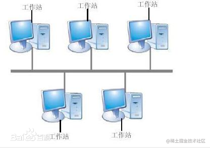

互联网初期，以太网的总线型拓扑比较普遍。随着总线型以太网上的站点数目增多,可靠性也会随之下降,而随着大规模集成电路以及专门芯片的发展,使得星型以太网变得便宜又可靠。
需要注意的是，以太网虽然物理上是星型拓扑，但逻辑上是总线型。

### 6.4 网卡

计算机传出的数据，经过网卡，就会变为以太网的帧，还会完成一些链路管理（CDMA/CD的实现），以及编码和译码（编码译码我不太理解。。。好像是曼彻斯特编码，规定如何表示高低电平）。

### 6.5 无线局域网

无线局域网WLAN是利用无线电波、激光和红外线等无线通信技术来构建的局域网。
无线局域网我们只介绍一下典型的网络结构。

* 上图的AP就是通信基站，如果基站覆盖的移动设备可以直接通过基站来通信
* 如果是不同基站的移动设备，不仅仅要通过自己的基站传输数据，还需要基站和基站之间传输数据，来达到两个在不同基站覆盖范围内的无线设备通信。

### 6.6 CSMA/CD协议

因为这个协议是以太网所使用的，所以我们只需要记住一些特点就行了。

* 每一个站在发送数据之前以及发送数据时以及发送数据时都要检测一下总线上是否有其他计算机在发送数据。
* 是总线型，半双工网络（半双工是指允许数据在两个方向上传输,但是,在某一时刻,只允许数据在一个方向上传输）

### 6.7 链路层的设备

#### （1）网桥

网桥根据MAC帧的目的地址进行转发和过滤。当网桥收到一个帧时，并不会向所有接口转发此帧，而是先检查此帧的目的MAC地址，然后再确定将该帧转发到哪一个口，或者是把它丢弃。
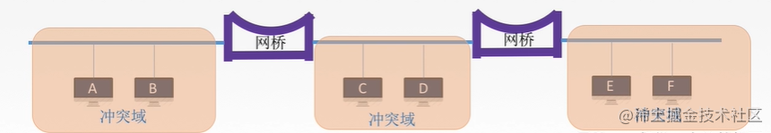

这里需要注意的是，网桥连接的是不同的网段，网段是什么呢，我这里简单介绍一下，具体要到讲IP地址的时候细说，同一网段指的是IP地址和子网掩码(讲ip地址的时候会细讲)相与得到相同的网络地址。

#### （2）以太网交换机

谈到交换机，就不得不提两个概念，冲突域和广播域

* 冲突域： 是指同一时间只能由一台设备发送信息的范围。
* 广播域：如果站点发出一个广播信号，所有能接收到这个信号的设备范围称为广播域
* 也就是说，广播域可以跨网段，而冲突域只是发生的同一个网段。
举个例子，公司里大家的电脑一般都是连接到交换机上，因为交换机可以隔离冲突域，冲突域的最大问题在于，同一时间只能有一台机器传输数据，公司那么多人，如果这样的话，传输数据速度太慢了。然后交换机再连接到路由器上，首先路由器能隔离广播域，其次不经过路由器，你的数据链路层上的包没办法进入到互联网里面去`，路由器是网络层的设备。
兄弟，能看完上面内容，你也真够能忍的，牛B，喝口水！继续！

## 7、 网络层

概念走一走，看一看，瞄一眼就行啦！

### 7.1 网络层概念

网络层主要任务是将分组(分组的概念是大多数计算机网络都不能连续地传送任意长的数据，所以实际上网络系统把数据分割成小块，然后逐块地发动，这种小块就称作分组)从一台主机移动到另一台主机，从而提供了主机到主机的通信服务和各种形式的进程到进程的通信。

### 7.2 学习网络层需要了解的概念

#### 7.2.1 分组交换

当主机H1要向另一主机H2发送数据（报文）时，首先将数据划分成若干个等长的分组，然后将这些分组一个接一个地发往里与H1相联的路由A ,当A接到分组后，先放入缓冲区，再按一定的路由算法确定该分组下一步将发注哪个结点，如此一个结点一个结点传递，直到最终目的H2。
这一段话比较啰嗦，简单来说分组就是分数据块，同时还具有无需建立连接，存储转发（存储转发是指以太网交换机的控制器先将输入端口到来的数据包缓存起来，先检查数据包是否正确，并过滤掉冲突包错误），动态分配路线（交换设备会根据网络状况选择不同的路线，比如路由器）的优点。

#### 7.2.2 数据报

数据报是通过网络传输的数据的基本单元，包含一个报头（header）和数据本身。说白了，就是带地址的数据，比如你的写了一句微信"你好"，这串文字本上加上源地址，目的地址，就是数据报。

#### 7.2.3 数据报格式

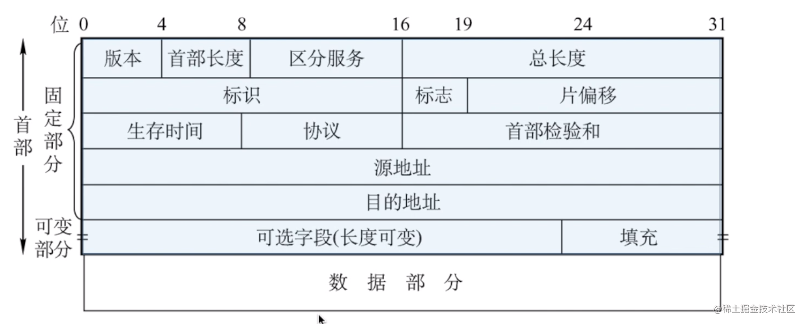

* 首部的固定部分是20字节，共20 * 8 = 160比特（1字节=8比特）
* 0 - 4 比特是版本号，版本有ipv4/ipv6
* 首部长度，单位是4B，最小为5, 为什么是5呢？因为首部至少20字节，所以4* 5就是20字节
* 区分服务不用看。
* 总长度是，首部+数据
* 生存时间是TTL，它告诉网络，数据包在网络中的时间是否太长而应被丢弃。每经过一个路由器减一，变成0就丢弃
* 协议是指数据部分用的什么协议，我们只需要知道TCP协议用6表示，UDP协议用17表示即可。
* 首部校验和占16位。这个字段只检验数据报的首部，但不包括数据部分。
* 目的地址和源地址都是IP地址，目的地址是通过DNS查询得来的。

#### 7.2.4 IP分片

#### 为什么要分片呢？

链路层数据帧封装的数据大小是有限制的，以太网的MTU（MTU是指一种通信协议的某一层上面所能通过的最大数据包大小）是1500字节。
接下来我们就看看在ip数据包上，哪些字段标识了分片的数据呢？
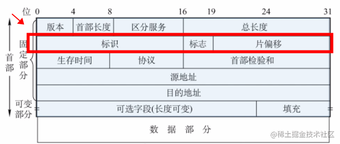

* 标识是在同一数据的分片时相同。
* 标志占3位，但只有两位有意义，第一个位叫MF，MF=1即表示后面“还有分片”的数据报。MF=0表示这已是若干数据报片中的最后一个。
* 标志字段中间的一位记为DF(Don’t Fragment)，意思是“不能分片”。只有当DF=0时才允许分片。
* 片偏移，较长的分组在分片后，某片在原分组中的相对位置。

#### 7.2.5 ip地址分类

#### ip地址有5种

* A类：1.0.0.0~126.255.255.255
* B类：128.0.0.0~191.255.255.255
* C类：192.0.0.0~223.255.255.255
* D类：224.0.0.0~239.255.255.255
* E类：240.0.0.0~254.255.255.255
* 其中127.0.0.0~127.255.255.255用于环回测试，D类地址用于组播，E类地址用于科研
这里需要注意的是，你发没发现，为什么我们前端启动webpack测试环境的时候，一般地址都是192.168.*.*(* 是指0-255的数字); 在公司和家里都是这个网段，不是很奇怪吗，你家里的网段怎么和公司一样呢？
其实是因为有一部分叫私有IP地址，是不能拿到网络上跟别的计算机通信的。只能是局域网自己内部用。比如说有：
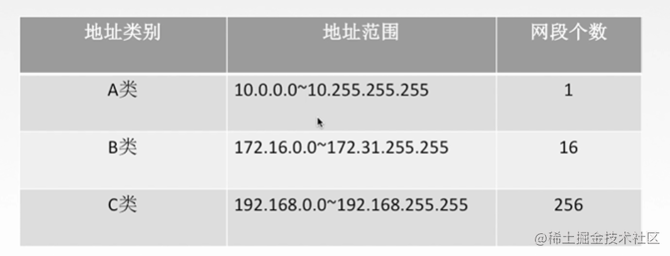

可以看到，C类私有地址就是192.168网段，每个局域网都可以有这些私有IP。
还有一些特殊地址，需要了解
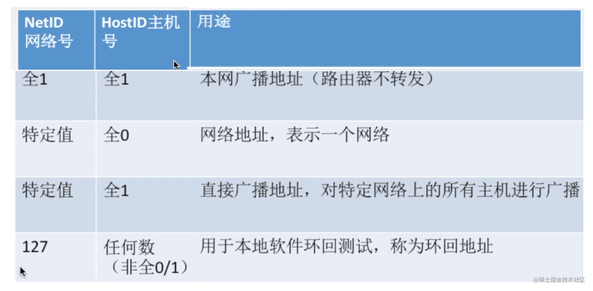

 注意，这里的全1是指，ipv4地址由4个字节组成，每一个字节是8位，8位全一就是十进制的255, 即255.255.255.255。

* 第一行，全一，代表是255.255.255.255，在本网络的目的地址写这个的话，就会内网广播
* 第二行，网络号特定值，主机号是全0，比如，192.169.10.1，这是c类网络，所以网络号是192.169.10，主机号是1，当主机号全0时，就是0，表示192.169.10.0这个网段
* 第三行，还是192.169.10.1这个c类地址，主机号都是1，也就是8个1，代表255，所以192.169.10.255表示本网段的广播地址
* 第四行，大家最熟悉不过了，127作为网络号，主机号非全0或1，比如说127.0.0.1代表本机，称为环回地址。

#### 7.2.6 网络地址转换(NAT)

在ip地址分类里面，我们知道私有ip地址是不能跟外网交互的，在小公司大多数计算机的地址都是192.168网段，都是私有ip地址，它是怎么跟外网交互数据的呢，这里就引出来一个知识点叫网络地址转换NAT。

如上图所示，192.168.0.3，192.168.0.4都是私有网段上的，它们无法跟外网通信，这个时候由于路由器安装了NAT软件，就可以将自己的ip地址，即路由器的ip地址172.38.1.5作为内网的代理，去访问外网，外网返回来的数据，经过路由转换，转换成内网的192.168网段的私有地址。

#### 7.2.7 子网划分和子网掩码

首先要明白，为什么要划分子网？
首先大家要知道： 总体来说，划分子网不但没有增加可用IP地址，而且减少了可用IP地址，因为每个子网中的全0网络地址和全1广播地址均不能作为主机ip来使用。
为什么划分子网：

* 例如，一个A类网络可以容纳16777214台主机。
* 但是在实际运用中，不可能把一个A类网络只用于一个子网，因为那样管理起来很不方便，也会出现广播风暴等种种问题，所以需要根据实际需求把它划分为若干个较小的子网。一个B类网络可以容纳65534台主机，往往也是需要划分子网的。
* 即便一个小型企业内部，为了部门之间的职能的需要，配置那些电脑可以互相访问，哪些不能互相访问，就需要通过划分子网的方法来实现。
接下来，我们看看子网划分

如上图右侧，我们将145.13.0.0这个网段划分了三个子网，其中一个是145.13.3.0，一个是145.13.21.0，问题来了，如果一个网络包来了，网络包要交给的ip地址是145.13.3.10，我们怎么知道给哪个子网呢？
方法是将目的包的ip地址，跟子网的子网掩码相与预算（二进制与预算规则是，1跟1得1，其它为0），也就是目的地址145.13.3.10跟子网145.13.3.0的子网掩码255.255.255.0的与预算，得到的结果是145.13.3.0，所以发送到的子网就是145.13.3.0。
这里有人会问什么是子网掩码，子网掩码的格式跟IP是一样的，0，0，0，0 到 255.255.255.255，主要是帮助我们划分子网的，了解到这里对我们前端就够了。

### 7.3 ARP协议

### 为什么需要ARP协议呢？

我们简单回顾一下以太网的帧的格式
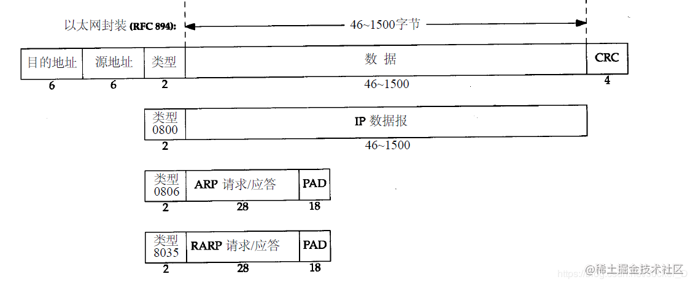

 上图有一个源地址和目的地址，这两个地址都是指的mac地址，mac地址是什么呢？简单说来就是两台相邻的路由器A和B，A怎么把数据传给B呢，它总要知道B的物理地址吧，物理地址就像门牌号一样，我要知道你住在哪里，才能把数据送过去吧？
首先你肯定知道自己的mac地址是多少，因为在网卡上有，问题在于，别人的mac地址是多少？ARP协议就是来帮你找mac地址的。
接着我们说一下ARP协议的过程（比较官方的介绍，看不懂可以略过）：
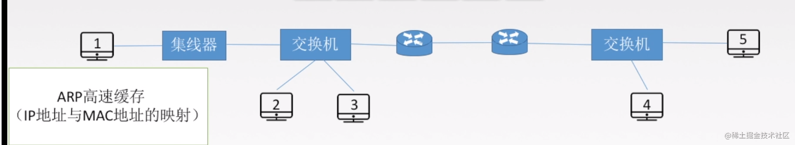

* 每台主机都会在自己的ARP缓冲区中建立一个 ARP列表，以表示IP地址和MAC地址的映射关系
* 当源主机需要将一个数据包要发送到目的主机时，会首先检查自己 ARP列表中是否存在该 IP地址对应的MAC地址
* 如果有，就直接将数据包发送到这个MAC地址；如果没有，就向本地网段发起一个ARP请求的广播包，查询此目的主机对应的MAC地址
* 此ARP请求数据包里包括源主机的IP地址、硬件地址、以及目的主机的IP地址。网络中所有的主机收到这个ARP请求后，会检查数据包中的目的IP是否和自己的IP地址一致
* 如果不相同就忽略此数据包；如果相同，该主机首先将发送端的MAC地址和IP地址添加到自己的ARP列表中
* 如果ARP表中已经存在该IP的信息，则将其覆盖，然后给源主机发送一个 ARP响应数据包，告诉对方自己是它需要查找的MAC地址
* 源主机收到这个ARP响应数据包后，将得到的目的主机的IP地址和MAC地址添加到自己的ARP列表中，并利用此信息开始数据的传输
* 如果源主机一直没有收到ARP响应数据包，表示ARP查询失败

### 7.4 DHCP协议

DHCP（动态主机配置协议）是一个局域网的网络协议。指的是由服务器控制一段lP地址范围，客户机登录服务器时就可以自动获得服务器分配的lP地址和子网掩码。说白了，当你接入局域网的时候，自动由这个dhcp服务器给你分配ip，windows用户可能知道网卡配置里面，由自动获取ip的功能，如果路由器提供DHCP服务，你就会自动获取随机分配的ip。
路由器里可以开启这个服务。

### 大致工作过程（了解即可）

### 7.5 ICMP协议

ICMP协议是一个网络层协议。 为什么我们需要ICMP协议呢？
一个新搭建好的网络，往往需要先进行一个简单的测试，来验证网络是否畅通；但是IP协议并不提供可靠传输。如果丢包了，IP协议并不能通知传输层是否丢包以及丢包的原因。
所以我们就需要一种协议来完成这样的功能–ICMP协议。

### ICMP协议的功能主要有

1. 确认IP包是否成功到达目标地址
2. 通知在发送过程中IP包被丢弃的原因 我们举一个例子：

主机H2收到主机H1的一个UDP包，结果H2发现这个包里的端口没有被监听，这时候就回复给H2一个ICMP应答报文，意思是这个UDP数据包，无法交给应用进程，只能丢弃了。
以下是4种常见的ICMP差错报告报文

我们常用的ping命令借助ICMP协议，探测主机是否能找到目的主机。

### 7.6 网络设备路由器简介

路由器是一种具有多个输入端口和多个输出端口的专用计算机，其任务是转发和分组。
如下图所示，分别由转发和分组功能的说明。

接着，我们看一下路由器输入端口做了哪些事情

* 首先，物理层是傻瓜层，传输比特流，我们把物理层的比特流还原成数据链路层的数据帧，然后把数据链路层的数据报脱去，成为网络层数据包，交给路由器。这时候就要判断一下这个数据包是什么类型的了。
* 如果它是路由器之间，交换路由信息的分组，就会把这个数据包交付给如上上图所示的，路由选择处理机，进行处理和计算。如果是数据分组，就会放到一个队列里面，排队等候，然后选择一个合适的输出端口输出。
* 最后我们看一下路由器输出端口做了哪些事情

 从上图可以看到，输出端口是做的输入端口的逆过程，将网络层的数据包转换为链路层的数据帧，最后转为物理层的比特流。
输入和输出端口需要注意的是，它们都有一个缓冲队列，比如输入数据的速度太快，输出数据速度慢，为了平衡输入输出速度，就用缓冲队列把数据缓冲下来，一个一个慢慢的处理，但缓冲队列也有限度，超出这个限度，缓冲队列容纳不下，包就会被丢到。
马上就要到对前端最重要的传输层和应用层知识了！准备接招！

## 8 传输层知识

传输层是只有计算机才有的层次，主要提供是进程间逻辑通信 + 可靠传输或者不可靠的功能。比如你的QQ跟你异地女友的QQ视频聊天，这就是不同计算机之间，进程间的通信。
这里简单说一下可靠传输协议TCP + 不可靠传输协议UDP。
TCP面向连接，可靠，不提供广播和多播，而且时间延迟比较大，适用于大文件传输。 UDP无连接，收到的报也不确认，但时间延迟小，适用于小文件。

### 8.1 端口号有什么用

端口号可以用来标识同一个主机上通信的不同应用程序（就是哪个应用程序在使用这个端口）。
那为什么一个端口只能分配给一个应用程序，不能是多个呢？
如果服务器有两个应用程序A，B，分别启动了A服务和B服务，它们监听同一个端口，那有数据来的时候，服务器无法判断这个数据到底是给A，还是给B。

### 8.2 UDP协议

UDP协议是参考模型中一种无连接的传输层协议，提供面向事务的简单不可靠信息传送服务。

#### （1） UDP协议的特点

* UDP是无连接的，减少开销和发送数据之前的时间延迟。大家都知道TCP的三次握手和四次分手，这个是需要时间花销的，但是UDP没有这部分花销。
* UDP使用最大努力交付，即不保证可靠交付。那谁来保证可靠的交付呢？是由UDP的上一层协议，应用层来保证。
* UDP是面向报文的，适合一次性传输少量数据的网络应用。什么意思呢，如下图，UDP这层，把应用层的全部内容作为自己的数据报部分，在IP层也只是加了一个IP首部，我们知道，在以太网，链路层上的数据如果超过1500字节，就会分片，所以网络层发现上面传输层给了太大的数据就会分片，加上UDP是不可靠的协议，这就加大了UDP的不可靠性，容易丢失，所以UDP适合数据量少的。
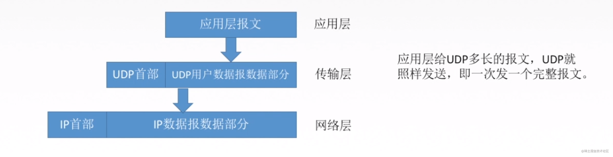

* UDP没有拥塞控制，适合很多实时应用。也就是说如果网络堵塞，UDP不管那么多，照样按照自己的速率发数据，那有些人就会说，这协议是不是有点坑B，路都堵上了，还发死劲发数据呢，但是反过来看，这也是UDP的优点，它允许丢包，如果你的网络情况还不错，UDP就非常适合实时应用，比如视频会议。
* UDP首部较小，只有8字节，而TCP由20字节。这也是减少网络传输开销的一方面。

#### （2）UDP首部

* 16位端口号占了2B，也就是16位，说明端口号的范围是0 - 65535。源端口号可以没有，因为不希望收到对方的回应，可以写全0，目的端口是一定要有的。
* 16位UDP长度是指首部+数据的长度，比如数据2B，首部固定是8B，那么UDP长度就是2+8 = 10B
* 16位UDP校验和，是用来校验首部和数据有错误，如果有错就丢弃掉。比如说目的主机找不到对应的端口号，就会给发送方返回一个ICMP，‘端口不可达’的差错报文。

#### 8.3 TCP协议

TCP协议简单来说是一种位于传输层的，面向连接的、可靠的、基于字节流的传输层通信协议 TCP协议的特点:

* TCP是面向连接的传输层协议。比如说TCP的三次握手，四次分手，针对的都是连接。
* 每一条TCP连接只能有两个端点，每一条TCP连接是点对点的。也就是说TCP是不同计算机之间的进程的通信。
* TCP提供可靠交付的服务，无差错，不丢失，不重复，按序到达。总结一下就是，可靠有序，不丢不重。
* TCP提供全双工通信。全双工指的是连接双方可以同时收发数据。在收发两端都有发送缓存和接收缓存，发送缓存就是一个准备发送的队列，接收缓存是一个准备接收的队列。
* TCP面向字节流。如下图，我们解释一下什么是面向字节流：

  图中的1，2，3，4.....数据块，每一个表示一个字节。tcp将应用层的数据变为了这样的字节进行发送，比如玩过node同学，知道一个buffer，buffer就是字节流。

#### TCP报文的首部格式

如下图所示，我们看一下比较重要的一些首部字段，这里我们介绍固定的20字节的TCP首部
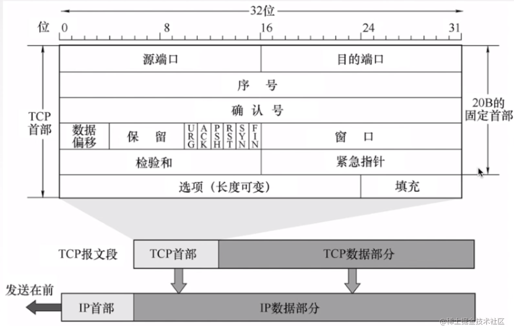

* 源端口和目的端口分别是指发送方应用程序的端口和目的方应用程序的端口号。
* 序号是指在一个TCP连接中传送的字节流中的每一个字节都按顺序编号，本字段表示本报文段所发送数据的第一个字节的序号。
* 确认号是指期望收到对方下一个报文段的第一个数据字节的序号。弱确认好位n，则证明到需要N-1为止所有的数据都已经正确收到。如下图，我们举例说明一下
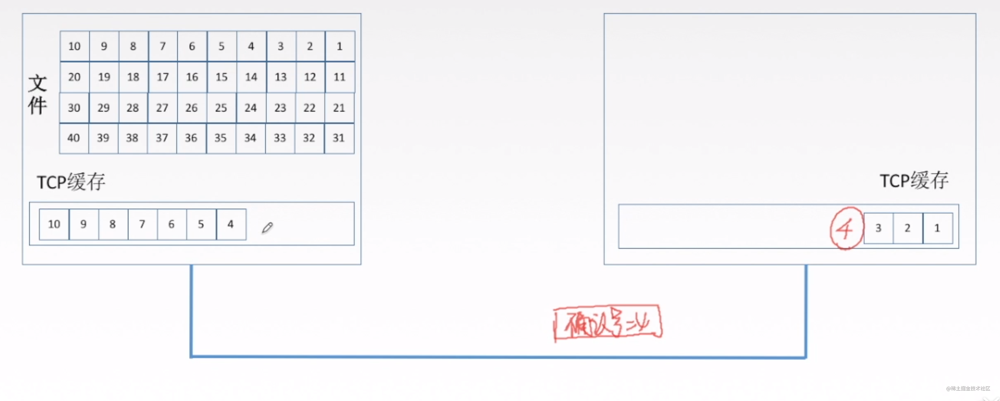

接收方收到了1，2，3个字节组成的数据包，然后接收方就会发送一个确认报文给发送方，其中确认报文的确认号就应该是4，因为1，2，3这三个字节的组成的数据包已经收到了。

* 数据偏移指的是TCP报文段的数据起始处举例TCP报文段的起始处有多远。
* 6个控制位介绍如下

#### 控制位 作用

ACK 置1时表示确认号合法，为0的时候表示数据段不包含确认信息，确认号被忽略
PSH 置1时请求的数据段在接收方得到后就可直接送到应用程序，而不必等到缓冲区满时才传送
RST 置1时重建连接。如果接收到RST位时候，通常发生了某些错
SYN 置1时用来发起一个连接
FIN 置1时表示发端完成发送任务。用来释放连接，表明发送方已经没有数据发送了
URG 紧急指针，告诉接收TCP模块紧要指针域指着紧要数据

#### 8.3.3 TCP建立连接

如下图所示，分别来了解一下建立连接的过程：

* 首先客户端要发送一个数据包告诉服务器要建立连接，根据上面我们了解到的控制位信息，建立连接需要把SYN置为1，seq指的是序号，是随机产生的。
* 然后服务器收到该数据包后，会为该TCP连接分配缓存和变量，缓存指的是一个字节流队列。（发送方和接收方都有这个队列，而且如果双方需要互相通信，那么双方都会有发送缓存和接收缓存），接着会返回一个确认报文，其中SYN控制位置为1，意思是允许建立连接，ACK是确认号，确认收到了发送方的包，并且会设一个seq序号，也为一个随机数。小写ack是确认号，也就是接下来希望发送方要发的数据从哪开始。
* 最后，客户端需要给服务器端返回一个确认，此时SYN控制位变为0，意思这不是建立连接的请求了，要正式发数据了，ACK是确认码，意思是收到了服务器的确认请求了。

#### 8.3.4 TCP释放连接

如下图所示，分别来了解一下释放连接的过程：

* 客户端发起请求，请求断开链接。FIN=1，seq=u。u是之前传送过来的最后一个字节的序号+1。
FIN：用来释放一个链接，当FIN=1的时候，表明此报文的发送方已经完成了数据的发送，没有新的数据要传送，并要求释放链接。 客户端等着服务器返回确认
* 服务器收到客户端的请求断开链接的报文之后，返回确认信息。ACK=1，seq=v，ack=u+1。这个时候，客户端不能给服务器发送信息报文，只能接收。但是服务器要是还有信息要传给服务器，仍然能传送。这里的v是什么意思呢，这就取决于服务器发送给客户端之前的一个包确认号是多少了。
* 当服务器也没有了可以传的信息之后，给客户端发送请求结束的报文。FIN=1，ACK=1，ack=u+1，seq=w。这里的w，跟上面的v是一个意思，为什么不都是v呢，因为这一步和上一步中间可能还在发数据呢，所以seq这个数据发送的字节流序号可能要变。
* 客户端接收到FIN=1的报文之后，返回确认报文，ACK=1，seq=u+1，ack=w+1。发送完毕之后，客户端进入等待状态，等待两个时间周期。关闭。
为什么最后还要等待两个时间周期呢？
* 客户端的最后一个ACK报文在传输的时候丢失，服务器并没有接收到这个报文。这个候时候服务器就会超时重传这个FIN消息，然后客户端就会重新返回最后一个ACK报文，等待两个时间周期，完成关闭。
* 如果不等待这两个时间周期，服务器重传的那条消息就不会收到。服务器就因为接收不到客户端的信息而无法正常关闭。

#### 8.3.5 TCP3次握手4次挥手常见面试题

为什么连接的时候是三次握手，关闭的时候却是四次握手？

* 关闭连接时，服务器收到对方的FIN报文时，仅仅表示对方不再发送数据了但是还能接收数据，而自己也未必全部数据都发送给对方了，所以己方可以立即关闭，也可以发送一些数据给对方后，再发送FIN报文给对方来表示同意现在关闭连接
* 因此，己方ACK和FIN一般都会分开发送，从而导致多了一次。
为什么不能用两次握手进行连接？

#### 以下是网上普遍的解答

* 若建立连接只需两次握手，客户端并没有太大的变化，仍然需要获得服务端的应答后才进入ESTABLISHED状态，而服务端在收到连接请求后就进入ESTABLISHED状态。
* 此时如果网络拥塞，客户端发送的连接请求迟迟到不了服务端，客户端便超时重发请求，如果服务端正确接收并确认应答，双方便开始通信，通信结束后释放连接。此时，如果那个失效的连接请求抵达了服务端，由于只有两次握手，服务端收到请求就会进入ESTABLISHED状态，等待发送数据或主动发送数据
* 但此时的客户端早已进入CLOSED状态，服务端将会一直等待下去，这样浪费服务端连接资源
* 但我觉得这个只是两次握手可能造成的问题，最关键的是两次握手有服务器对客户端的起始序列号做了确认，但客户端却没有对服务器的起始序列号做确认，不能保证传输的可靠性。
如果已经建立了连接，但是客户端突然出现故障了怎么办？
TCP保活计时器 每次客户端请求服务器会重置计时器，当2小时之内没收到客户端任何数据时，会每隔75s向客户端发一个探测报文，若接连发送10个，客户端都没有反应，则认为客户端故障，关闭连接。

#### 什么是SYN洪泛攻击？

* SYN洪泛攻击就是利用TCP协议的特性（三次握手）。
* 攻击者发送TCP的 SYN，SYN是TCP三次握手中第一个数据包，而当服务器返回ACK后，该攻击者就不对其进行再确认，那这个TCP连接就处于挂起状态，也就是半连接状态，服务器收不到再确认的话，还会重复发送ACK给攻击者。
* 这样更加会浪费服务器资源。攻击者就对服务器发送大量的这种TCP连接，由于每一个连接都无法完成三次握手，所以就在服务器上，这些TCP连接会因为挂起状态而消耗CPU和内存，最后服务器可能死机。
序号（ISN）为什么要随机？ 增加安全性，为了避免被第三方猜测到，从而被第三方伪造的RST报文Reset。 三次握手的第一次可以携带数据吗？为何？
* 不可以，三次握手还没有完成。而且这样会放大SYN FLOOD（SYN洪泛）攻击。
* 如果攻击者伪造了成千上万的握手报文，携带了1K+ 字节的数据，而接收方会开辟大量的缓存来容纳这些巨大数据，内存会很容易耗尽，从而拒绝服务。
三次握手的第三次可以携带数据吗？为何？ 第三次握手，此时客户端已经处于ESTABLISHED状态。对于客户端来说，他已经建立起连接了，并且已经知道服务器的接收和发送能力是正常的。所以也就可以携带数据了。

#### 8.3.6 TCP如何实现可靠传输

主要通过以下四种方式实现可靠传输机制：

* 校验。伪首部是为了增加TCP校验和的检错能力：通过伪首部的目的IP地址来检查TCP报文是否收错了、通过伪首部的传输层协议号来检查传输层协议是否选对了。需要注意的是，伪首部实际上是不存在的，只是用来验证TCP报文是否出错。
* 序号。之前我们提到TCP是面向字节流的，比如第一个字节就是序号1，第二个字节就是序号2。 而在TCP报文格式介绍的时候，有一个序号字段，这个指的是一个报文段第一个字节的序号。报文段就是你每个数据包。有了序号，就能保证数据是有序的传入应用层。
* 确认。发送方在收到接收方的确认包之后，才继续发送剩下的数据。
* 重传。TCP的发送方在规定的时间内没有收到确认就要重传已发送的报文段（超时重传）。重传时间是动态改变的，依据的是RTTS（加权平均往返时间）。

#### 8.3.7 TCP的流量控制

#### 为什么需要流量控制呢？

比如发送方发送速度非常快，接收方接收速度特别慢，这样就会发生严重的丢包现象。
 TCP通过滑动窗口的机制来实现流量控制。简单来说如下(建议网上找一个动画教程来理解，文字效果不是很好):

* TCP 中采用滑动窗口来进行传输控制，滑动窗口的大小意味着接收方还有多大的缓冲区可以用于接收数据。发送方可以通过滑动窗口的大小来确定应该发送多少字节的数据。
* 当滑动窗口为 0 时，发送方一般不能再发送数据报，但有两种情况除外，一种情况是可以发送紧急数据，例如，允许用户终止在远端机上的运行进程。另一种情况是发送方可以发送一个 1 字节的数据报来通知接收方重新声明它希望接收的下一字节及发送方的滑动窗口大小。

#### 8.3.8 TCP的拥塞控制

这部分我也觉得文字部分太生硬了，开始我也不怎么理解，看来一个视频之后我了解了基本原理，这里我文字版和视频地址都放上来。
视频地址如下：拥塞控制视频版

#### 文字版如下

* 如果网络出现拥塞，分组将会丢失，此时发送方会继续重传，从而导致网络拥塞程度更高。因此当出现拥塞时，应当控制发送方的速率。这一点和流量控制很像，但是出发点不同。流量控制是为了让接收方能来得及接收，而拥塞控制是为了降低整个网络的拥塞程度。
* TCP 主要通过四个算法来进行拥塞控制：慢开始、拥塞避免、快重传、快恢复。
* 发送方需要维护一个叫做拥塞窗口（cwnd）的状态变量，注意拥塞窗口与发送方窗口的区别：拥塞窗口只是一个状态变量，实际决定发送方能发送多少数据的是发送方窗口。
* 为了便于讨论，做如下假设：
* 接收方有足够大的接收缓存，因此不会发生流量控制；
* 虽然 TCP 的窗口基于字节，但是这里设窗口的大小单位为报文段。

#### 慢开始与拥塞避免

* 发送的最初执行慢开始，令 cwnd = 1，发送方只能发送 1 个报文段；当收到确认后，将 cwnd 加倍，因此之后发送方能够发送的报文段数量为：2、4、8 ...
* 注意到慢开始每个轮次都将 cwnd 加倍，这样会让 cwnd 增长速度非常快，从而使得发送方发送的速度增长速度过快，网络拥塞的可能性也就更高。设置一个慢开始门限 ssthresh，当 cwnd >= ssthresh 时，进入拥塞避免，每个轮次只将 cwnd 加 1。
如果出现了超时，则令 ssthresh = cwnd / 2，然后重新执行慢开始。

#### 快重传与快恢复

* 在接收方，要求每次接收到报文段都应该对最后一个已收到的有序报文段进行确认。例如已经接收到 M1 和 M2，此时收到 M4，应当发送对 M2 的确认。
* 在发送方，如果收到三个重复确认，那么可以知道下一个报文段丢失，此时执行快重传，立即重传下一个报文段。例如收到三个 M2，则 M3 丢失，立即重传 M3。
* 在这种情况下，只是丢失个别报文段，而不是网络拥塞。因此执行快恢复，令 ssthresh = cwnd / 2 ，cwnd = ssthresh，注意到此时直接进入拥塞避免。
* 慢开始和快恢复的快慢指的是 cwnd 的设定值，而不是 cwnd 的增长速率。慢开始 cwnd 设定为 1，而快恢复 cwnd 设定为 ssthresh。

## 9、应用层

### 9.1 应用层有啥用？

应用层对应用程序的通信提供服务。

* 区分是发送报文还是接收报文
* 定义报文类型的语法，比如某字段的意思，例如http中content-type字段是什么意思。
* 最后就是进程如何，什么时候把传输层的数据交给应用层。
一些比较重要的应用层协议如下图：

### 9.2 应用层常见的模型

第一种是客户端/服务器模型，也就是C/S架构。比如电子邮件、web都是。
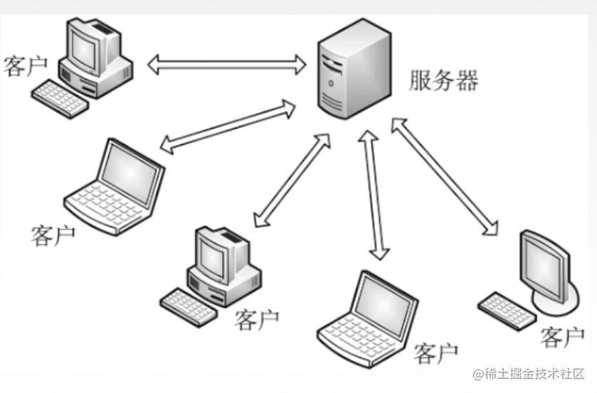

第二种是P2P模型，每个主机既可以提供服务，也可以请求服务。比如迅雷下载也是使用P2P技术的。

### 9.3 短链接和长链接

而TCP连接有两种工作方式：短连接方式（Short-Live Connection）和长连接方式（Long-Live Connection）。

#### 短连接方式

* 当客户端有请求时，会建立一个TCP连接，接收到服务器响应后，就断开连接。下次有请求时，再建立连接，收到响应后，再断开。如此循环。这种方式主要有两个缺点：
* 建立TCP连接需要3次“握手”，拆除TCP连接需要4次“挥手”，这就需要7个数据包。如果请求和响应各占1个数据包，那么一次短连接的交互过程，有效的传输仅占2/9，这个利用率太低了。
* 主动断开TCP连接的一端，TCP状态机会进入TIME_WAIT状态。如果频繁地使用短连接方式，就有可能使客户端的机器产生大量的处于TIME_WAIT状态TCP连接。

#### 长连接方式

* 客户端和服务器建立TCP连接后，会一直使用这条连接进行数据交互，直到没有数据传输或异常断开。在空闲期间，通常会使用``心跳数据包（Keep-Alive）`保持链路不断开。目前长连接方式应用范围比较广泛。

### 9.4 DNS

什么是DNS说白了就是将域名转化为ip，比如www.qq.com，这是域名，可以是网络包需要对方ip地址，域名是不能加入网络包报头的，所以就需要去找一个服务器问，qq的域名对应的ip是多少。

#### 大概的通信过程如下

* 用户主机上运行着DNS的客户端，就是我们的PC机或者手机客户端运行着DNS客户端了
* 浏览器将接收到的url中抽取出域名字段，就是访问的主机名，比如<http://www.baidu.com/>, 并将这个主机名传送给DNS应用的客户端
* DNS客户机端向DNS服务器端发送一份查询报文，报文中包含着要访问的主机名字段（中间包括一些列缓存查询以及分布式DNS集群的工作）
* 该DNS客户机最终会收到一份回答报文，其中包含有该主机名对应的IP地址
* 一旦该浏览器收到来自DNS的IP地址，就可以向该IP地址定位的HTTP服务器发起TCP连接
这里需要补充一个小知识，关于域名的，大概了解一下就行

### 9.5 万维网和http协议

万维网www是一个大规模的、联机式的信息存储所，是无数个网络站点和网页的集合。
知识盲区： 在不少人看来，互联网、因特网、万维网没有大多的区别，其实这三者之间的关系应该是：互联网包含因特网，因特网包含万维网。

* 互联网internet。凡是由能彼此通信的设备组成的网络就叫互联网，即使仅有两台机器（计算机、手机等），不论用何种技术使其彼此通信，都叫互联网，所以，互联网有广域网、城域网及局域网之分，国际标准的互联网写法是internet，字母i一定要小写！
* 因特网Internet。而因特网是互联网中的一种，它可不是仅有两台机器组成的网络，而是由上千万台设备组成的网络（该网络具备很大的规模）。因特网使用TCP/IP协议让不同的设备可以彼此通信。但使用TCP/IP协议的网络并不一定是因特网，一个局域网也可以使用TCP/IP协议。
* 因特网是基于TCP/IP协议实现的，TCP/IP协议由很多协议组成，不同类型的协议又被放在不同的层，其中，位于应用层的协议就有很多，比如FTP、SMTP、HTTP。所以，因特网提供的服务一般包括有：www（万维网）服务、电子邮件服务（outlook）、远程登录（QQ）服务、文件传输（FTP）服务、网络电话等等。
* 万维网。只要应用层使用的是HTTP协议，就称为万维网(World Wide Web)。之所以在浏览器里输入百度网址时，能看见百度网提供的网页，就是因为您的个人浏览器和百度网的服务器之间使用的是HTTP协议在交流。
万维网使用统一资源定位符作为标识符来访问资源。

#### URL的格式如下

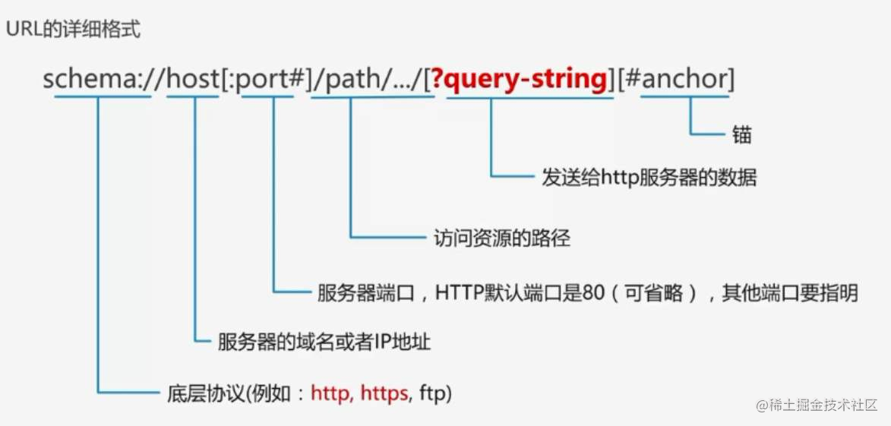

* 用户通过点击超链接获取资源，这些资源通过超文本传输协议（http）传送给使用者。
* HTTP协议定义了浏览器怎样向万维网服务器请求万维网文档，以及服务器怎样把文档传送给浏览器。

#### http报文头分析

 下面是对各部分的简要描述：

1. 方法(method)：客户端希望服务器对资源执行的动作，是一个单独的词，比如，GET、POST或HEAD
2. 请求URL(request-URL)：要直接与服务器进行对话，只要请求URL是资源的绝对路径就可以了，服务器可以假定自己是URL的主机/端口
3. 版本(version)：报文所使用的HTTP版本。其格式：HTTP/<主要版本号>.<次要版本号>
4. 状态码(status-code)：状态码是三位数字，描述了请求过程中所发生的情况。每个状态码的第一位数字都用于描述状态的一般类别(比如，“成功”、“出错”等等)
5. 原因短语(reason-phrase)：数字状态码的可读版本，包含行终止序列之前的所有文本。原因短语只对人类有意义，因此，尽管响应行HTTP/1.0 200 NOT OK和HTTP/1.0 200 OK中原因短语的含义不同，但同样都会被当作成功指示处理
6. 头部(header)：可以有零个或多个头部，每个首部都包含一个名字，后面跟着一个冒号(:)，然后是一个可选的空格，接着是一个值，最后是一个CRLF首部是由一个空行(CRLF)结束的，表示了头部列表的结束和实体主体部分的开始
7. 实体的主体部分(entity-body)：实体的主体部分包含一个由任意数据组成的数据块，并不是所有的报文都包含实体的主体部分，有时，报文只是以一个CRLF结束。
下面是常用头部：

##### 通用头部：既可以出现在请求报文中，也可以出现在响应报文中，它提供了与报文相关的最基本的信息

* Connection：允许客户端和服务器指定与请求/响应连接有关的选项，http1.1默认是keep-alive
* Date：提供日期和时间标志，说明报文是什么时间创建的
* Transfer-Encoding：告知接收端为了保证报文的可靠传输，对报文采用了什么编码方式
* Cache-Control：用于随报文传送缓存指示
请求头部：请求头部是只在请求报文中有意义的头部。用于说明是谁或什么在发送请求、请求源自何处，或者客户端的喜好及能力
* Host：给出了接收请求的服务器的主机名和端口号
* Referer：提供了包含当前请求URI的文档的URL
* User-Agent：将发起请求的应用程序名称告知服务器
* Accept：告诉服务器能够发送哪些媒体类型
* Accept-Encoding：告诉服务器能够发送哪些编码方式
* Accept-Language：告诉服务器能够发送哪些语言
* Range：如果服务器支持范围请求，就请求资源的指定范围
* If-Range：允许对文档的某个范围进行条件请求
* Authorization：包含了客户端提供给服务器，以便对其自身进行认证的数据
* Cookie：客户端用它向服务器传送数据

##### 响应头部：响应头部为客户端提供了一些额外信息，比如谁在发送响应、响应者的功能，甚至与响应相关的一些特殊指令

* Age：(从最初创建开始)响应持续时间
* Server：服务器应用程序软件的名称和版本
* Accept-Ranges：对此资源来说，服务器可接受的范围类型
* Set-Cookie：在客户端设置数据，以便服务器对客户端进行标识

##### 实体首部：描述主体的长度和内容，或者资源自身

* Allow：列出了可以对此实体执行的请求方法
* Location：告知客户端实体实际上位于何处，用于将接收端定向到资源的位置(URL)上去
* Content-Base：解析主体中的相对URL时使用的基础URL
* Content-Encoding：对主体执行的任意编码方式
* Content-Language：理解主体时最适宜使用的自然语言
* Content-Length：主体的长度
* Content-Type：这个主体的对象类型
* ETag：与此实体相关的实体标记
* Last-Modified：这个实体最后一次被修改的日期和时间

##### 实体的主体部分：该部分其实就是HTTP要传输的内容，是可选的。HTTP报文可以承载很多类型的数字数据，比如，图片、视频、HTML文档电子邮件、软件应用程序等等
