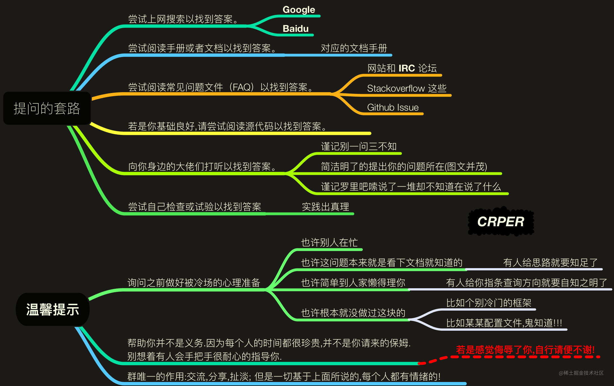

# 提问的艺术

## 正确的提问

* 先自己折腾，尝试一番。如果能搞定，那感情好的；如果搞不定，这时候对问题来龙去脉有点思路了。
* 百度、bing、Google（好吧，Google 在国内被墙了，还真没咋用过梯子，所以 Google 不常用）。根据折腾时候给出的思路，尝试找到比较相似的解决方案，再次进行折腾，如果还搞不定，那就询问下群里大佬。
* 向群友求助：“小伙伴们，有使用过框架 A 的吗？我编译的时候它报 B 的错误，然后我尝试用 C 方法进行解决了，但是没成功，于是百度了关键字 D，再尝试了 E 方法，现在想知道是哪里出问题了，可以帮忙看看嘛？谢谢~”
* 向大佬提问：“大佬，在不，问你个问题！在框架 A 中，我编译的时候它报 B 的错误，然后我尝试用 C 方法进行解决了，但是没成功，于是百度了关键字 D，再尝试了 E 方法，不知道是我的思路错了，还是解决中疏漏了哪个步骤，你有空帮忙看看不？谢谢~”

## 反例

* 大佬：（要介绍妹子么？回不回？）“在的，你说。”
* 萌新：“关于 A 这个框架中的 §№☆●◎□◆○◎★▲△■※￡¤￠℃￥ξοωχυλβιμητσ 问题，怎么搞啊？”
* 大佬：（没用过 A，百度了下，看到一堆现成解决方案，揉揉头）“你说这个问题啊，是有解决方案的，下次你可以先百度瞅瞅。我对 A 也没用过，不过我看了几篇文章，觉得可以说明白你那些问题。”（发送几篇参考文献）
* 萌新：（没回复了）
* ……过了一天……
* 萌新：“大佬，在不，问你个问题撒~”
* 大佬：（极不情愿，回不回？）“在的，怎么了，下次你可以一次性把问题发出来，我看到就会回你的。”
* 萌新：“是这样的，在框架 A 中，关于 §№☆●◎□◆○◎★▲△■※￡¤￠℃￥ξοωχυλβιμητσ 的问题，不知道怎么搞，弄了好久没弄出来。”
* 大佬：（还是没用过 A，百度了下，又看到一堆现成解决方案，又揉揉头）“这个问题百度也是有解决方案的，大致瞅了下，这几篇也是可以的。”（发送几篇参考文献）
* 萌新：“大佬，你看下能不能直接告诉我怎么解决不，我这里急着要解决啊，我看这些文章来解决问题的话太耗时了，赶不及啊~”
* 大佬：（皱眉，瞅了下那几篇文章）“大致就是 1、**，2、**，就可以解决了。”
* 萌新：（又不见了）
* ……又过了一天……
* 萌新：“大佬，在不？问你个问题撒~”
* 大佬：（回不回？不回了不回了）
* 萌新：“Hello？大佬哪去了？”
* 大佬：（跑去某个群里水了两句，放松了一下，准备回去工作）
* 萌新：“艹！你这 sb，叫你两句大佬还牛起来了是吧，摆架子是吧？！有空去群里水就是不回我，就你这垃圾 ……”
* 大佬：（拉黑删好友二连）
* 虽然，现实中应该很少几率会出现最后破口大骂的情形。
* 但是，至少 jsliang 还是曾见过几次的，为那几个大佬默哀几秒。
* 当然，今天不是来讲这个的，此处略去不表，jsliang 谈谈自己关于这则故事的观点：
* 在不？ 这句话有没有让在座大多数小伙伴一阵心肌梗塞的感觉？你是回呢还是不回呢？
* 直接提问。有问题先 百度、bing、Google 撒，毕竟大佬很忙的撒，好不容易处理完自己事情，看到你这问题，结果一百度发现感觉又回到了工作状态，这是另类为你打工啊~
* 问完就溜。就算 TCP 关闭还要挥手啊，你这一不说解决没有，二不来声谢谢，很闹心的！
* 重复提问。大佬说了不懂框架 A 啦，下次可以注意点，要不然就像你每天被人问：“有女票吗？”问多几次，你会不会想砍了它啊。
* 只要结果。过分了吧，大佬成为百度中转站不说，还要帮你提炼解决方法。
* 破口大骂。……这……

## 提问常识

* 要知道，Free 的正确翻译是 自由，而非 免费。即便回答你的人由时间。
* 要知道，愿意回答问题的人，都是 可爱 的人。
* 要知道，向帮助你的人 付费 是一个高尚的行为。即便回答你的人不是为了钱。
* 要知道，花钱买时间是一个常识。如果你不能认同，要么你钱包穷，要么你思想穷。
* 要知道，给对方发工资的不是你或者你老板。
* 要知道，提问的时候你才是 孙子，对 大爷 客气点。
* 要知道，不回答你的问题，对其他人没有任何损失。
* 要知道，准确描述一件事情 是一项基本生存技能。
* 要知道，搜索 是一项基本生存技能，学不会用 Google 的话，你可能真的不适合你所从事的行业。
* 要知道，英文 是一项基本生存技能，不认识英文的话，你可能真的不适合你所从事的行业。
