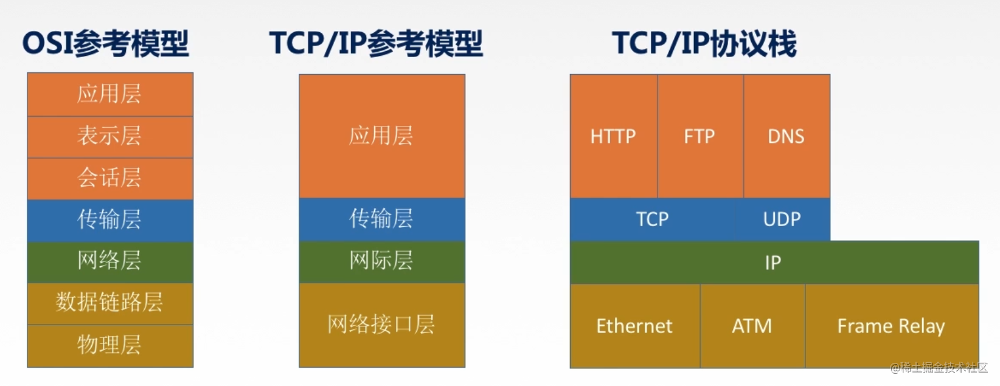

# 计算机网络分层结构

## 一、几种分层结构

## 二、OSI参考模型

* 目的：支持异构网络系统的互联互通（制定一个标准）
* 7层结构

* 巧记：物链网输会示用（一个叫淑慧的人试用物联网）
* 通信子网：专注于数据传输通信（邮寄）
* 资源子网：专注于数据处理（包装）

### 1. 应用层

* 用户与网络的界面
* 所有能和用户交互产生网络流量的程序
* 典型应用层服务：文件传输（FTP）、电子邮件（SMTP）、万维网（HTTP）

### 2. 表示层

* 处理两种通信系统中交换信息的表示方式
* 比如说，数据格式变换（编码格式之间的转换，使得不同主机之间即使在不同的编码格式上，也能消息互通）
* 数据加密解密（password传输）
* 数据压缩和恢复（发送端压缩，接受端解压缩）
* 在TCP/IP中被纳入到应用层中

### 3. 会话层

* 向表示层实体/用户进程提供建立连接并在连接上有序地传输数据
* 建立连接（建立一个session）
* 建立同步（SYN）
* 功能一：建立、管理、终止会话
* 功能二：使用校验点可使在通信失效和恢复之后，从校验点继续恢复通信，无需从头开始。适用于传输大文件。
* ADSP、ASP

### 4. 传输层

* 负责主机中两个进程的通信，即端对端的通信。传输单位是报文段或用户数据报。（因为是端口号之间的通信，因此是端对端）
* 下面的几层，是计算机与计算机之间的通信，因此是点对点的通信。
* 功能一：可靠传输与不可靠传输。（即存不存在确认机制）
* 功能二：差错控制。对发生的差错，如何控制。
* 功能三：流量控制。传输速度匹配控制，接收方根据自己的处理速度，控制发送方速度。
* 功能四：复用分用。复用，即多个进程同时使用下面传输层的服务（两个进程的消息携带着端口号一起发送给传输层）；分用，即运输层将接收到的信息分发到不同的进程。
* （可差留用，绝不认输）
* 主要协议：TCP、UDP

### 5. 网络层

* 主要任务：把分组从源端传送到目的端，为分组交换网上的不同主机提供通信服务。（数据过大时进行切割）（实现网际互联）
* 传输单位是数据包
* 功能一：路由选择。通过路由选择算法，选择合适的路由器路径进行传输。
* 功能二：流量控制。限制发送方速度。
* 功能三：差错控制。比如说，奇偶校验码。
* 功能四：拥塞控制。若所有节点都来不及接受分组了，而要丢弃大量分组，这时候就处于网络拥塞状态。
* 主要协议：IP、IPX、ICMP、IGMP、ARP、RARP、OSPF

### 6. 数据链路层

* 把网络层传下来的数据包组装成帧。
* 传输单位是帧。
* 功能一：成帧。（定义帧的开始和结束）
* 功能二：差错控制。帧错+位错。
* 功能三：流量控制
* 功能四：访问（接入）控制。控制对信道的访问。控制哪台主机可以占用信道。

* 主要协议：SDLC、HDLC、PPP、STP

### 7. 物理层

* 将比特流转换为电信号进行传输。
* 物理传输单位是比特。
* 透明传输：不管给什么比特流，都转发。
* 功能一：定义接口特性。（物理上，接口怎么接）
* 功能二：定义传输模式，单工、半双工、双攻
* 功能三：定义传输速率
* 功能四：比特同步
* 功能五：比特编码
* 常见协议：RJ45、802.3

## 三、TCP/IP模型

## 四、5层参考模型

