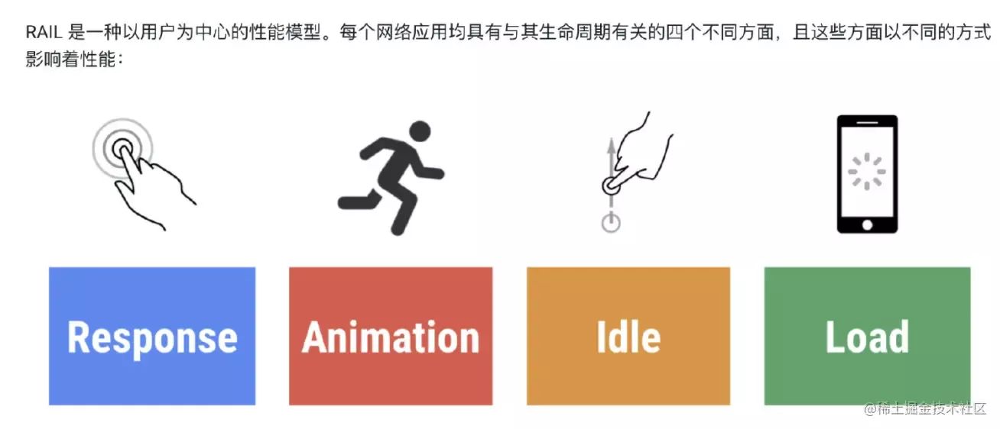
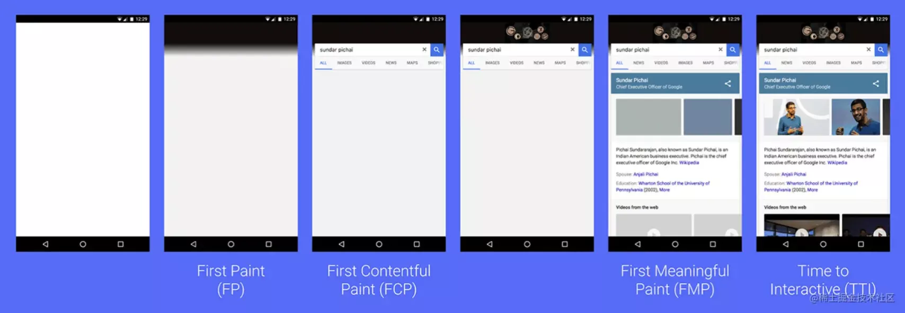

# 前端性能监控Performance

## 一、为什么需要性能监控

web 的性能一定程度上影响了用户留存率，Google DoubleClick 研究表明：如果一个移动端页面加载时长超过 3 秒，用户就会放弃而离开。BBC 发现网页加载时长每增加 1 秒，用户就会流失 10%。
我们希望通过监控来知道web应用性能的现状和趋势，某次发布后的性能情况怎么样，是否发布后对性能有影响，感知到业务出错的概率，业务的稳定性怎么样...

## 二、监控什么

首先我们需要知道应该监控些什么呢？有哪些具体的指标？
Google 开发者提出了一种 RAIL 模型来衡量应用性能，即：Response、Animation、Idle、Load，分别代表着 web 应用生命周期的四个不同方面
并指出最好的性能指标是：100ms 内响应用户输入；动画或者滚动需在 10ms 内产生下一帧；最大化空闲时间；页面加载时长不超过 5 秒。


### 我们可转化为三个方面来看

1. 响应速度：页面初始访问速度 + 交互响应速度
2. 页面稳定性：页面出错率，如资源加载错误，JS 执行报错
3. 外部服务调用：网络请求访问速度
本篇文章主要讨论第一方面，响应速度，主要利用window.performance实现

### 三、性能指标

Google开发者针对用户体验，提出的几个性能指标


1. FP：首次绘制
First Paint：标记浏览器渲染任何在视觉上不同于导航前屏幕内容之内容的时间点
2. FCP：首次内容绘制
First Contentful Paint：标记的是浏览器渲染来自 DOM 第一位内容的时间点，该内容可能是文本、图像、SVG等
3. FMP：首次有效绘制
First Meaningful Paint：首次有效绘制，标记主角元素渲染完成的时间点，主角元素可以是视频网站的视频控件，内容网站的页面框架也可以是资源网站的头图等
4. TTI：页面可交互时间
Time to Interactive：页面可交互时间，即从页面开始加载，一直到用户可以自由输入或操作页面的时间
四、window.performance基础
Performance 接口可以获取到当前页面中与性能相关的信息，以通过调用只读属性 Window.performance 来获得

### 4.1 属性

* navigation：返回一个 PerformanceNavigation 对象。这个对象表示出现在当前浏览上下文的 navigation 类型，比如获取某个资源所需要的重定向次数
  * redirectCount：表示在到达这个页面之前重定向了多少次
  * type：表示是如何导航到这个页面的
    * 0：当前页面是通过点击链接，书签和表单提交，或者脚本操作，或者在url中直接输入地址，type值为0
    * 1：点击刷新页面按钮或者通过Location.reload()方法显示的页面
    * 2：页面通过历史记录和前进后退访问时
    * 255：任何其他方式，type值为255
* timing：已废弃，使用 window.performance.getEntriesByType('navigation') 来替代，即 PerformanceNavigationTiming
* timeOrigin：实验中功能，返回一个表示 the performance measurement 开始时间的高精度 timestamp
* memory：其是 Chrome 添加的一个非标准扩展，这个属性提供了一个可以获取到基本内存使用情况的对象。不应该使用这个非标准的 API
* onresourcetimingbufferfull：当浏览器的资源时间性能缓冲区已满时会触发

### 4.2 window.performance.timing属性


#### 21个属性，如下

属性名 含义

* connectStart 返回与服务端建立连接开始时间，如果是持久连接或者是从缓存中获取资源，则这个值等于domainLookupEnd
* connectEnd 返回与服务端建立连接完成时间，如果是持久连接或者是从缓存中获取资源，则这个值等于domainLookupEnd
* domComplete html文档完全解析完毕的时间节点
* domContentLoadedEventEnd DOMContentLoaded事件触发的结束时间
* domContentLoadedEventStart DOMContentLoaded事件触发的结开始时间
* domInteractive 返回当前网页DOM结构结束解析、开始加载内嵌资源(如js、css)时，即Document.readyState变为interactive的时间
* domLoading 返回当前网页DOM结构开始解析时，即Document.readyState变为loading时的时间戳
* domainLookupEnd 返回查询DNS结束时间，如果是持久连接或者是从缓存中获取资源，则这个值等于fetchStart
* domainLookupStart 返回查询DNS开始时间，如果是持久连接或者是从缓存中获取资源，则这个值等于fetchStart
* fetchStart 如果要使用“GET”请求方法获取新资源，fetchStart返回的是浏览器发起请求到检测缓存前时间，否则直接返回浏览器请求时间
* loadEventEnd 返回onload完成时间，当load事件尚未触发时，它返回零
* loadEventStart 返回onload开始时间，当load事件尚未触发时，它返回零
* navigationStart 返回上一个url卸载时间，如果没有上一个url，则这个值等于fetchStart，在 PerformanceNavigationTiming 中已废弃
* redirectEnd 返回最后一个HTTP重定向完成时间，如果没有重定向，或者重定向中的一个不同源，这个值会返回0
* redirectStart 返回第一个HTTP重定向开始时间，如果没有重定向，或者重定向中的一个不同源，这个值会返回0
* requestStart 返回浏览器向服务器发出HTTP请求时间
* responseEnd 返回浏览器从服务器收到（或从本地缓存读取，或从本地资源读取）最后一个字节时间（如果在此之前HTTP连接已经关闭，则返回关闭时）的时间
* responseStart 返回浏览器从服务器收到（或从本地缓存读取）第一个字节时间。如果传输层在开始请求之后失败并且连接被重开，该属性将会被数制成新的请求的相对应的发起时间
* secureConnectionStart 返回浏览器与服务器开始安全链接的握手时间，如果当前网页不要求安全连接，则返回0
* unloadEventEnd 返回unload处理完成时间，如果当前url与上一个url是同源，则返回的值是指上一个页面卸载到这个页面用户代理开始前时间，如果与上一个不同域或者没有上一个url，则返回0
* unloadEventStart 返回unload开始处理时间，如果当前url与上一个url是同源，则返回的值是指上一个页面卸载到这个页面用户代理后时间，如果与上一个不同域或者没有上一个url，则返回0

### 4.3 PerformanceNavigationTiming属性


与1.2中timing字段一致，不同点如下：

#### （1）比1.2timing多以下字段

属性名 含义

* decodedBodySize 返回编码后字节大小
* duration 即 PerformanceNavigationTiming.loadEventEnd (en-US)
 和 PerformanceEntry.startTime (en-US)
 属性之间的差值
* encodedBodySize 返回编码前字节大小
* entryType 返回 "navigation"
* initiatorType 返回 "navigation"
* name 返回页面url
* nextHopProtocol 网路资源协议
* redirectCount 重定向数
* serverTiming 返回列表 PerformanceServerTiming
* startTime 返回开始记录性能时间，0
* transferSize 响应头和响应体大小
* type 一个 string
* 表示导航类型，取值为为：“navigate”，“reload”，“back_forward”或“prerender”
* workerStart 如果有 worker，则返回 worker 的开始时间

#### （2）比1.2timing少以下字段

* domLoading、navigationStart
* PerformanceTiming 中每个属性记录时间戳，所有的属性是基于 navigationStart 来计算耗时的，而 PerformanceNavigationTiming 中的属性是耗时已经计算好，所以去掉了 navigationStart 和 domLoading

### 4.4 timing各字段渲染顺序


## 五、各指标计算方式

* 指标 计算方式 说明
* 页面加载总耗时 loadEventEnd - startTime 指页面完全加载完所用的时间，这时候触发完成了 onload 事件
* DNS解析耗时 domainLookupEnd - domainLookupStart 指通过域名解析服务（DNS），将指定的域名解析成IP地址所消耗的时间
* TCP连接耗时 connectEnd - connectStart 指浏览器和WEB服务器建立TCP/IP连接所用的时间
* SSL连接耗时 location.protocol === 'https:' ? connectEnd - secureConnectionStart 只在 HTTPS 下有效，属于TCP连接耗时的一部分，指安全连接握手耗时
* 网路请求耗时 responseStart - requestStart 指开始发送请求到服务器返回第一个字节所需要的时间
* 数据传输耗时 responseEnd-responseStart 指服务器端返回第一个字节到最后一个字节所需要的时间
* DOM解析耗时 domContentLoadedEventEnd - responseEnd 指页面请求完成（responseEnd）后，到整个 DOM 解析完所用的时间，页面的复杂度决定了 DOM 解析耗时
* 资源加载耗时 loadEventEnd - domContentLoadedEventEnd 指 DOM 解析完成后到页面完全加载完所用的时间
* 首包时间 responseStart - startTime 指从页面请求到浏览器开始接收到数据所用的时间
* 页面渲染耗时 loadEventEnd - responseEnd 等于页面完全加载时间 - HTML 加载完成时间（见下面指标）
* 页面完全加载时间 loadEventEnd - startTime 指页面完全加载完所用的时间，这时候触发完成了 onload 事件
* 白屏时间 优先使用最新标准

```js
 performance.getEntriesByType['paint'](0).startTime，不支持的话使用 Chrome、IE 提供的 firstPaintTime，chrome.loadTimes().firstPaintTime 或 performance.msFirstPaint，还没有获取，取 domInteractive - startTime但是实际上报取的值是：loadEventEnd - startTime 首次渲染时间，指页面出现第一个文字或图像所花费的时间
```

* 页面加载完时间 loadEventEnd - startTime 指页面完全加载完所用的时间，这时候触发完成了 onload 事件
* HTML加载完时间 responseEnd - startTime 指页面所有 HTML 加载完成（不包括页面渲染时间），即包括 DNS、TCP、Request 和 Response
* 首次交互时间 domInteractive - startTime 指页面 DOMContentLoaded 事件触发的开始时间，这时候页面可以交互
* 首屏时间 有两种方式：第一种通过计算首屏区域内的所有图片加载时间，然后取其最大值；第二种方式：通过 window.MutationObserver 来监听首屏所有元素变化情况，并记录时间，最后取其最大值（会去掉得分相同重复的值），算出的时间需要加上 domInteractive（可交互时间），目前系统采用第二种实现方式，如果第二种取不到，取 domInteractive，但该值会比实际首屏时间要小 首屏时间，也称用户完全可交互时间，即整个页面首屏完全渲染出来，用户完全可以交互，一般首屏时间小于页面完全加载时间，该指标值可以衡量页面访问速度

## 六、首屏时间

我们知道首屏时间是一项重要指标，但是又很难从 performance 中拿到，来看下首屏时间计算主要有哪些方式？

* 用户自定义打点—最准确的方式（只有用户自己最清楚，什么样的时间才算是首屏加载完成）
* lighthouse 中使用的是 chrome 渲染过程中记录的 trace event
* 可利用 Chrome DevTools Protocol 拿到页面布局节点数目。思想是：获取到当页面具有最大布局变化的时间点
* aegis 的方法：利用 MutationObserver 接口，监听 document 对象的节点变化。
* 检查这些变化的节点是否显示在首屏中，若这些节点在首屏中，那当前的时间点即为首屏渲染时间。但是还有首屏内图片的加载时间需要考虑，遍历 performance.getEntries() 拿到的所有图片实体对象，根据图片的初始加载时间和加载完成时间去更新首屏渲染时间。
* 利用 MutationObserver 接口提供了监视对 DOM 树所做更改的能力，是 DOM3 Events 规范的一部分。
* 方法：在首屏内容模块插入一个 div，利用 Mutation Observer API 监听该 div 的 dom 事件，判断该 div 的高度是否大于 0 或者大于指定值，如果大于了，就表示主要内容已经渲染出来，可计算首屏时间。
* 某个专利：在 loading 状态下循环判断当前页面高度是否大于屏幕高度，若大于，则获取到当前页面的屏幕图像，通过逐像素对比来判断页面渲染是否已满屏。
