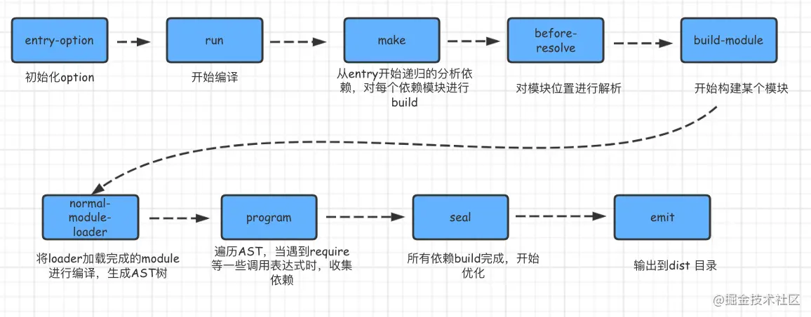

# webpack面试题

## Webpack 的编译过程

* 输入：从文件系统读入代码文件；
* 模块递归处理：调用 Loader 转译 Module 内容，并将结果转换为 AST，从中分析出模块依赖关系，进一步递归调用模块处理过程，直到所有依赖文件都处理完毕；
* 后处理：所有模块递归处理完毕后开始执行后处理，包括模块合并、注入运行时、产物优化等，可以理解在处理优化 模块递归转换出来的 AST ; 最终输出 Chunk 集合；
* 输出：将 Chunk 写出到外部文件系统；

## Webpack 的打包过程

* 合并webpack.config.js和命令行传递的参数，形成最终的配置
* 解析配置，得到entry入口
* 读取入口文件内容，通过@babel/parse将入口内容（code）转换成ast
* 通过@babel/traverse遍历ast得到模块的各个依赖
* 通过@babel/core（实际的转换工作是由@babel/preset-env来完成的）将ast转换成es5 code
* 通过循环伪递归的方式拿到所有模块的所有依赖并都转换成es5

### 从上述打包流程角度，Webpack 配置项大体上可分为两类

* 流程类：作用于打包流程某个或若干个环节，直接影响编译打包效果的配置项
* 工具类：打包主流程之外，提供更多工程化工具的配置项

### 流程类配置项综述

与打包流程强相关的配置项有

* 输入输出：
  * entry：用于定义项目入口文件，Webpack 会从这些入口文件开始按图索骥找出所有项目文件；
  * context：项目执行上下文路径；
  * output：配置产物输出路径、名称等；
* 模块处理：
  * resolve：用于配置模块路径解析规则，可用于帮助 Webpack 更精确、高效地找到指定模块
  * module：用于配置模块加载规则，例如针对什么类型的资源需要使用哪些 Loader 进行处理
  * externals：用于声明外部资源，Webpack 会直接忽略这部分资源，跳过这些资源的解析、打包操作
* 后处理：
  * optimization：用于控制如何优化产物包体积，内置 Dead Code Elimination、Scope Hoisting、代码混淆、代码压缩等功能
  * target：用于配置编译产物的目标运行环境，支持 web、node、electron 等值，不同值最终产物会有所差异
  * mode：编译模式短语，支持 development、production 等值，可以理解为一种声明环境的短语
这里的重点是，Webpack 首先需要根据输入配置(entry/context) 找到项目入口文件；之后根据按模块处理(module/resolve/externals 等) 所配置的规则逐一处理模块文件，处理过程包括转译、依赖分析等；模块处理完毕后，最后再根据后处理相关配置项(optimization/target 等)合并模块资源、注入运行时依赖、优化产物结构等。
这些配置项与打包流程强相关，建议学习时多关注它们对主流程的影响，例如 entry 决定了项目入口，而 output 则决定产物最终往哪里输出；resolve 决定了怎么找到模块，而 module 决定了如何解读模块内容，等等。

### 工具类配置项综述

除了核心的打包功能之外，Webpack 还提供了一系列用于提升研发效率的工具，大体上可划分为：

* 开发效率类：
  * watch：用于配置持续监听文件变化，持续构建
  * devtool：用于配置产物 Sourcemap 生成规则
  * devServer：用于配置与 HMR 强相关的开发服务器功能
* 性能优化类：
  * cache：Webpack 5 之后，该项用于控制如何缓存编译过程信息与编译结果
  * performance：用于配置当产物大小超过阈值时，如何通知开发者
* 日志类：
  * stats：用于精确地控制编译过程的日志内容，在做比较细致的性能调试时非常有用
  * infrastructureLogging：用于控制日志输出方式，例如可以通过该配置将日志输出到磁盘文件
* 等等

## webpack treeShaking机制的原理

* treeShaking 也叫摇树优化，是一种通过移除多于代码，来优化打包体积的，生产环境默认开启。
* 可以在代码不运行的状态下，分析出不需要的代码；
* 利用es6模块的规范
* ES6 Module引入进行静态分析，故而编译的时候正确判断到底加载了那些模块
* 静态分析程序流，判断那些模块和变量未被使用或者引用，进而删除对应代码

## webpack有哪些常⻅的Loader

* file-loader：把⽂件输出到⼀个⽂件夹中，在代码中通过相对 URL 去引⽤输出的⽂件
* url-loader：和 file-loader 类似，但是能在⽂件很⼩的情况下以 base64 的⽅式把⽂件内容注⼊到代码中去
* source-map-loader：加载额外的 Source Map ⽂件，以⽅便断点调试
* image-loader：加载并且压缩图⽚⽂件
* babel-loader：把 ES6 转换成 ES5
* css-loader：加载 CSS，⽀持模块化、压缩、⽂件导⼊等特性
* style-loader：把 CSS 代码注⼊到 JavaScript 中，通过 DOM 操作去加载 CSS。
* eslint-loader：通过 ESLint 检查 JavaScript 代码

## webpack 常见的plugin有哪些

* ProvidePlugin：自动加载模块，代替require和import
* html-webpack-plugin可以根据模板自动生成html代码，并自动引用css和js文件
* extract-text-webpack-plugin 将js文件中引用的样式单独抽离成css文件
* DefinePlugin 编译时配置全局变量，这对开发模式和发布模式的构建允许不同的行为非常有用。
* HotModuleReplacementPlugin 热更新
* optimize-css-assets-webpack-plugin 不同组件中重复的css可以快速去重
* webpack-bundle-analyzer  一个webpack的bundle文件分析工具，将bundle文件以可交互缩放的treemap的形式展示。
* compression-webpack-plugin  生产环境可采用gzip压缩JS和CSS
* happypack： 通过多进程模型，来加速代码构建
* clean-wenpack-plugin  清理每次打包下没有使用的文件
* speed-measure-webpack-plugin:可以看至U每个Loader和Plugin执行耗时（整个打包耗时、每个Plugin和 Loader 耗时）
* webpack-bundle-analyzer:可视化Webpack输出文件的体积（业务组件、依赖第三方模块

## webpack 的构建流程是什么

* 初始化参数：解析webpack配置参数，合并shell传入和webpack.config.js文件配置的参数,形成最后的配置结果；
* 开始编译：上一步得到的参数初始化compiler对象，注册所有配置的插件，插件 监听webpack构建生命周期的事件节点，做出相应的反应，执行对象的run方法开始执行编译；
* 确定入口：从配置的entry入口，开始解析文件构建AST语法树，找出依赖，递归下去；
* 编译模块：递归中根据文件类型和loader配置，调用所有配置的loader对文件进行转换，再找出该模块依赖的模块，再递归本步骤直到所有入口依赖的文件都经过了本步骤的处理；
* 完成模块编译并输出：递归完事后，得到每个文件结果，包含每个模块以及他们之间的依赖关系，根据entry或分包配置生成代码块chunk;
* 输出完成：输出所有的chunk到文件系统；

1. webpack 的运行流程是一个串行的过程，从启动到结束会依次执行以下流程：首先会从配置文件和 Shell 语句中读取与合并参数，并初始化需要使用的插件和配置插件等执行环境所需要的参数；
2. 初始化完成后会调用Compiler的run来真正启动webpack编译构建过程，webpack的构建流程包括compile、make、build、seal、emit阶段，执行完这些阶段就完成了构建过程。

## webpack Plugin 和 Loader 的区别

loader是文件加载器，能够加载资源文件，并对文件进行一些处理，如编译，压缩 等，最终一起打包到指定的文件中。

* plugin赋予了webpack各种灵活的功能，如打包优化，资源管理，环境变量，注入等，目的是为了解决loader无法实现的功能。

* loader运行在项目打包之前；
* plugins运行在整个项目的编译时期；

在Webpack运行的整个生命周期中会广播出许多事件，Plugin会监听这些事件，在合适的事件通过 webpack 提供的 api 改变输出结果。
对于 loader 而言，它实质上是一个转换器，将A文件编译成B文件，操作的是 文件 ，比如将A文件编译成B文件，单纯的是一个文件转换过程。
