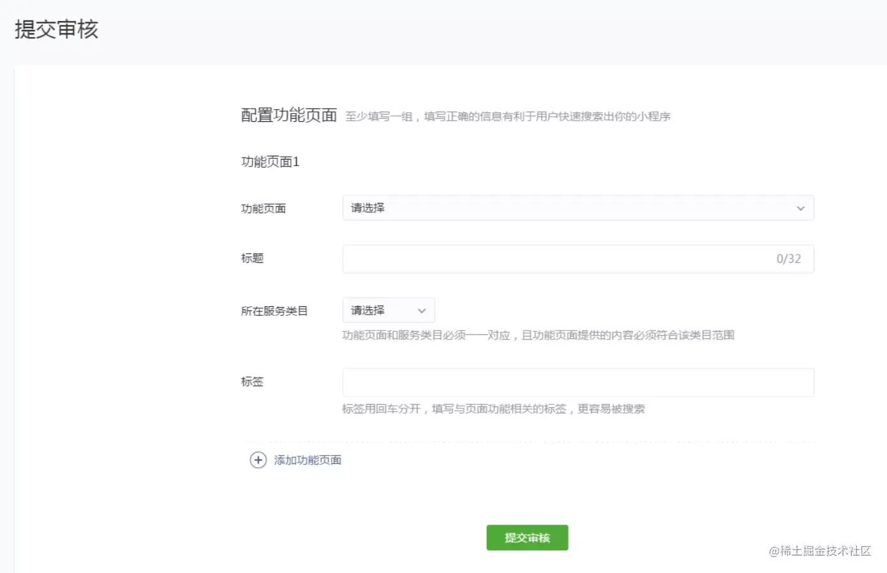

# 微信小程序的发布流程

## 一、背景

在中大型的公司里，人员的分工非常仔细，一般会有不同岗位角色的员工同时参与同一个小程序项目。为此，小程序平台设计了不同的权限管理使得项目管理者可以更加高效管理整个团队的协同工作

以往我们在开发完网页之后，需要把网页的代码和资源放在服务器上，让用户通过互联网来访问
在小程序的平台里，开发者完成开发之后，需要在开发者工具提交小程序的代码包，然后在小程序后台发布小程序

## 二、流程

### 关于发布的流程，主要分成了三个部分

* 上传代码
* 提交审核
* 发布版本

### 上传代码

在开发者工具中，可以点击代码上传功能：

然后就可以填写版本信息：

然后点击上传，编译器则会提示上传代码成功

### 提交审核

代码上传完毕，就可以登陆微信公众号的官网首页，点击【开发管理】，查看应用详情：

提交审核过程需要填写审核信息，如下图：

提交审核成功之后如下图：

### 发布版本

当审核通过之后，即可提交发布

发布成功之后则如下：

## 三、扩展

### 上述是最简单的小程序代码发布的流程，通常的流程如下

* 代码管理服务器上新建分支
* 开发测试新需求
* 测试完成后，将本地分支合并到 master 分支
* 拉取 master 分支最新代码，执行 build 命令生成小程序可执行文件
* 开发者工具点击“上传”
* 提审
* 发布
但是面对多人协调开发的时候，有可能出现已经上线的代码还没合并到master的情况
因此可以考虑自动化构建部署，就是将从开发到部署的一系列流程变成自动化，衔接连贯，在构建失败时能够告知开发者，构建成功后能够告知测试和实施人员，可参考如下流程图：
