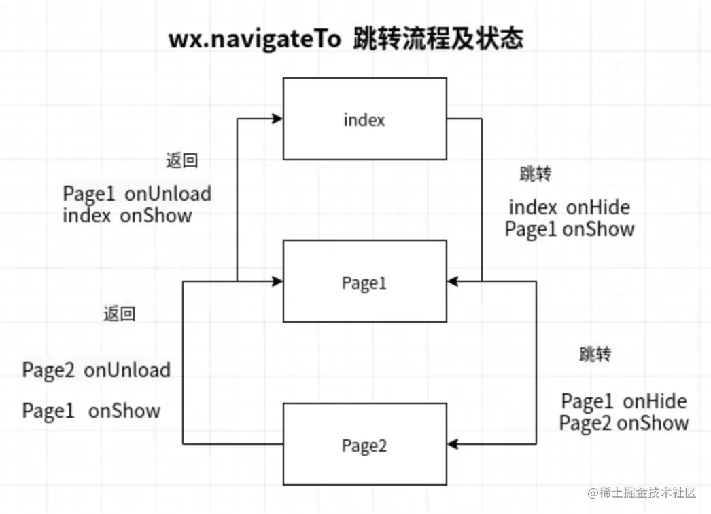

# 微信小程序中路由跳转的方式有哪些？区别？

## 一、是什么

微信小程序拥有web网页和Application共同的特征，我们的页面都不是孤立存在的，而是通过和其他页面进行交互，来共同完成系统的功能
在微信小程序中，每个页面可以看成是一个 pageModel，pageModel 全部以栈的形式进行管理

## 二、有哪些

### 常见的微信小程序页面跳转方式有如下

* wx.navigateTo(Object)
* wx.redirectTo(Object)
* wx.switchTab(Object)
* wx.navigateBack(Object)
* wx.reLaunch(Object)

### wx.navigateTo(Object)

wx.navigateTo()用于保留当前页面、跳转到应用内的某个页面，使用 wx.navigateBack可以返回到原页面
对于页面不是特别多的小程序，通常推荐使用 wx.navigateTo进行跳转， 以便返回原页面，以提高加载速度。当页面特别多时，则不推荐使用

#### 参数表如下所示

#### 流程图如下

### wx.redirectTo(Object)

重定向，当页面过多时，被保留页面会挤占微信分配给小程序的内存，或是达到微信所限制的 10 层页面栈的情况下，我们应该考虑选择 wx.redirectTo
wx.redirectTo()用于关闭当前页面，跳转到应用内的某个页面
这样的跳转，可以避免跳转前页面占据运行内存，但返回时页面需要重新加载，增加了返回页面的显示时间

#### 参数表如下所示

#### 流程图如下所示

### wx.switchTab(Object)

跳转到 tabBar 页面，并关闭其他所有非 tabBar 页面

#### 参数表如下所示

### wx.navigateBack(Object)

wx.navigateBack() 用于关闭当前页面，并返回上一页面或多级页面，开发者可通过 getCurrentPages() 获取当前的页面栈，决定需要返回几层则设置对象的delta属性即可

#### 参数表如下

### wx.reLaunch(Object)

关闭所有页面，打开到应用内的某个页面，返回的时候跳到首页

#### 参数表如下所示

#### 流程图如下所示

## 三、总结

### 关于上述五种跳转方式，做下总结

* navigateTo 保留当前页面，跳转到应用内的某个页面，使用 wx.navigateBack 可以返回到原页
* redirectTo 关闭当前页面，跳转到应用内的某个页面
* switchTab 跳转到 tabBar 页面，同时关闭其他非 tabBar 页面
* navigateBack 返回上一页面
* reLanch 关闭所有页面，打开到应用内的某个页面

### 其中关于它们的页面栈的关系如下

* avigateTo 新页面入栈
* redirectTo 当前页面出栈，新页面入栈
* navigateBack 页面不断出栈，直到目标返回页，新页面入栈
* switchTab 页面全部出栈，只留下新的 Tab 页面
* reLanch 页面全部出栈，只留下新的页面
