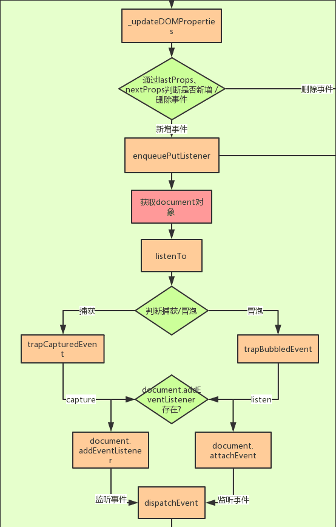
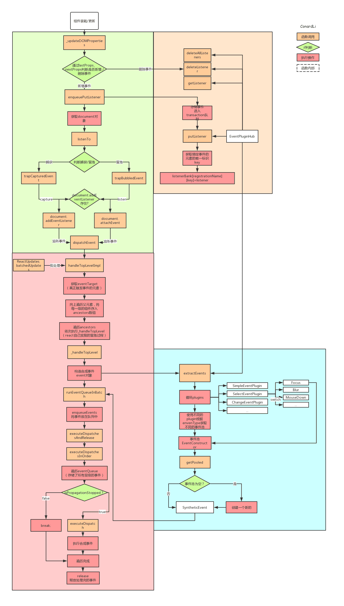

# 事件机制

## React 为什么有自己的事件系统？

首先，对于不同的浏览器，对事件存在不同的兼容性，React 想实现一个兼容全浏览器的框架， 为了实现这个目标就需要创建一个兼容全浏览器的事件系统，以此抹平不同浏览器的差异。
独特的事件处理

## 冒泡阶段和捕获阶段

* 冒泡阶段：开发者正常给 React 绑定的事件比如 onClick，onChange，默认会在模拟冒泡阶段执行。
* 捕获阶段：如果想要在捕获阶段执行可以将事件后面加上 Capture 后缀，比如 onClickCapture，onChangeCapture。

## 阻止冒泡

React 中如果想要阻止事件向上冒泡，可以用 e.stopPropagation()

* React 阻止冒泡和原生事件中的写法差不多，当如上 handleClick上 阻止冒泡，父级元素的 handleFatherClick 将不再执行，但是底层原理完全不同，接下来会讲到其功能实现。
阻止默认行为
* React 阻止默认行为和原生的事件也有一些区别。
* 原生事件： e.preventDefault() 和 return false 可以用来阻止事件默认行为，由于在 React 中给元素的事件并不是真正的事件处理函数。所以导致 return false 方法在 React 应用中完全失去了作用。
* React事件 在React应用中，可以用 e.preventDefault() 阻止事件默认行为，这个方法并非是原生事件的 preventDefault ，由于 React 事件源 e 也是独立组建的，所以 preventDefault 也是单独处理的。

## 什么是事件合成 ？

* 第一个部分是事件合成系统，初始化会注册不同的事件插件。
* 第二个就是在一次渲染过程中，对事件标签中事件的收集，向 container 注册事件。
* 第三个就是一次用户交互，事件触发，到事件执行一系列过程。

## 事件合成概念

* React 的事件不是绑定在元素上的，而是统一绑定在顶部容器上，在 v17 之前是绑定在 document 上的，在 v17 改成了 app 容器上。这样更利于一个 html 下存在多个应用（微前端）。
* 绑定事件并不是一次性绑定所有事件，比如发现了 onClick 事件，就会绑定 click 事件，比如发现 onChange 事件，会绑定 [blur，change ，focus ，keydown，keyup] 多个事件。
* React 事件合成的概念：React 应用中，元素绑定的事件并不是原生事件，而是React 合成的事件，比如 onClick 是由 click 合成，onChange 是由 blur ，change ，focus 等多个事件合成。

## 事件插件机制

React 有一种事件插件机制，比如上述 onClick 和 onChange ，会有不同的事件插件 SimpleEventPlugin ，ChangeEventPlugin 处理

### 第一个 registrationNameModules

``` tsx
const registrationNameModules = {
    onBlur: SimpleEventPlugin,
    onClick: SimpleEventPlugin,
    onClickCapture: SimpleEventPlugin,
    onChange: ChangeEventPlugin,
    onChangeCapture: ChangeEventPlugin,
    onMouseEnter: EnterLeaveEventPlugin,
    onMouseLeave: EnterLeaveEventPlugin,
    ...
}
```

registrationNameModules 记录了 React 事件（比如 onBlur ）和与之对应的处理插件的映射，比如上述的 onClick ，就会用 SimpleEventPlugin 插件处理，onChange 就会用 ChangeEventPlugin 处理。应用于事件触发阶段，根据不同事件使用不同的插件。

### 第二个registrationNameDependencies

``` tsx
{
    onBlur: ['blur'],
    onClick: ['click'],
    onClickCapture: ['click'],
    onChange: ['blur', 'change', 'click', 'focus', 'input', 'keydown', 'keyup', 'selectionchange'],
    onMouseEnter: ['mouseout', 'mouseover'],
    onMouseLeave: ['mouseout', 'mouseover'],
    ...
}
```

这个对象保存了 React 事件和原生事件对应关系，这就解释了为什么上述只写了一个 onChange ，会有很多原生事件绑定在 document 上。在事件绑定阶段，如果发现有 React 事件，比如 onChange ，就会找到对应的原生事件数组，逐一绑定。

## 为什么要用不同的事件插件处理不同的 React 事件

首先对于不同的事件，有不同的处理逻辑；对应的事件源对象也有所不同，React 的事件和事件源是自己合成的，所以对于不同事件需要不同的事件插件处理。

## 为什么不能用 return false 来阻止事件的默认行为？

* 因为React 重写了事件
* React 中给元素的事件并不是真正的事件处理函数。所以导致 return false 方法在 React 应用中完全失去了作用。
* 在React应用中，可以用 e.preventDefault() 阻止事件默认行为，这个方法并非是原生事件的 preventDefault ，由于 React 事件源 e 也是独立组建的，所以 preventDefault 也是单独处理的。

## 事件是绑定在真实的dom上吗？如何不是绑定在哪里？

* React 的事件不是绑定在元素上的，而是统一绑定在顶部容器上，在 v17 之前是绑定在 document 上的，在 v17 改成了 app 容器上。这样更利于一个 html 下存在多个应用（微前端）。

### 1.为什么要手动绑定this

通过事件触发过程的分析，dispatchEvent调用了invokeGuardedCallback方法。

``` tsx
function invokeGuardedCallback(name, func, a) {
  try {
    func(a);
  } catch (x) {
    if (caughtError === null) {
      caughtError = x;
    }
  }
}
```

可见，回调函数是直接调用调用的，并没有指定调用的组件，所以不进行手动绑定的情况下直接获取到的this是undefined。
这里可以使用实验性的属性初始化语法 ，也就是直接在组件声明箭头函数。箭头函数不会创建自己的this，它只会从自己的作用域链的上一层继承this。因此这样我们在React事件中获取到的就是组件本身了。

### 2.React事件和原生事件有什么区别

* React 事件使用驼峰命名，而不是全部小写。
* 通过 JSX , 你传递一个函数作为事件处理程序，而不是一个字符串。
* 另一个区别是，在 React 中你不能通过返回false 来阻止默认行为。必须明确调用 preventDefault。
由上面执行机制我们可以得出：React自己实现了一套事件机制，自己模拟了事件冒泡和捕获的过程，采用了事件代理，批量更新等方法，并且抹平了各个浏览器的兼容性问题。

### 3.React事件和原生事件的执行顺序，可以混用吗

* react的所有事件都挂载在document中
* 当真实dom触发后冒泡到document后才会对react事件进行处理
* 所以原生的事件会先执行
* 然后执行react合成事件
* 最后执行真正在document上挂载的事件

### 4.react事件和原生事件可以混用吗？

react事件和原生事件最好不要混用。
原生事件中如果执行了stopPropagation方法，则会导致其他react事件失效。因为所有元素的事件将无法冒泡到document上。
由上面的执行机制不难得出，所有的react事件都将无法被注册。

### 5. 合成事件、浏览器兼容

``` tsx
  function handleClick(e) {
    e.preventDefault();
    console.log('The link was clicked.');
  }
```

这里， e 是一个合成的事件。 React 根据W3C规范 定义了这个合成事件，所以你不需要担心跨浏览器的兼容性问题。
事件处理程序将传递 SyntheticEvent 的实例，这是一个跨浏览器原生事件包装器。 它具有与浏览器原生事件相同的接口，包括stopPropagation() 和 preventDefault() ，在所有浏览器中他们工作方式都相同。
每个SyntheticEvent对象都具有以下属性：

``` tsx
boolean bubbles
boolean cancelable
DOMEventTarget currentTarget
boolean defaultPrevented
number eventPhase
boolean isTrusted
DOMEvent nativeEvent
void preventDefault()
boolean isDefaultPrevented()
void stopPropagation()
boolean isPropagationStopped()
DOMEventTarget target
number timeStamp
string type
```

React合成的SyntheticEvent采用了事件池，这样做可以大大节省内存，而不会频繁的创建和销毁事件对象。
另外，不管在什么浏览器环境下，浏览器会将该事件类型统一创建为合成事件，从而达到了浏览器兼容的目的。

## 事件注册



* 组件装载 / 更新。
* 通过lastProps、nextProps判断是否新增、删除事件分别调用事件注册、卸载方法。
* 调用EventPluginHub的enqueuePutListener进行事件存储
* 获取document对象。
* 根据事件名称（如onClick、onCaptureClick）判断是进行冒泡还是捕获。
* 判断是否存在addEventListener方法，否则使用attachEvent（兼容IE）。
* 给document注册原生事件回调为dispatchEvent（统一的事件分发机制）。

## 事件存储


* EventPluginHub负责管理React合成事件的callback，它将callback存储在listenerBank中，另外还存储了负责合成事件的Plugin。
* EventPluginHub的putListener方法是向存储容器中增加一个listener。
* 获取绑定事件的元素的唯一标识key。
* 将callback根据事件类型，元素的唯一标识key存储在listenerBank中。
* listenerBank的结构是：listenerBank.registrationName.key。

## 事件触发 / 执行


这里的事件执行利用了React的批处理机制，在前一篇的【React深入】setState的执行机制中已经分析过，这里不再多加分析。

* 触发document注册原生事件的回调dispatchEvent
* 获取到触发这个事件最深一级的元素
* 遍历这个元素的所有父元素，依次对每一级元素进行处理。
* 构造合成事件。
* 将每一级的合成事件存储在eventQueue事件队列中。
* 遍历eventQueue。
* 通过isPropagationStopped判断当前事件是否执行了阻止冒泡方法。
* 如果阻止了冒泡，停止遍历，否则通过executeDispatch执行合成事件。
* 释放处理完成的事件。

## 合成事件


* 调用EventPluginHub的extractEvents方法。
* 循环所有类型的EventPlugin（用来处理不同事件的工具方法）。
* 在每个EventPlugin中根据不同的事件类型，返回不同的事件池。
* 在事件池中取出合成事件，如果事件池是空的，那么创建一个新的。
* 根据元素nodeid(唯一标识key)和事件类型从listenerBink中取出回调函数
* 返回带有合成事件参数的回调函数

## 总流程


