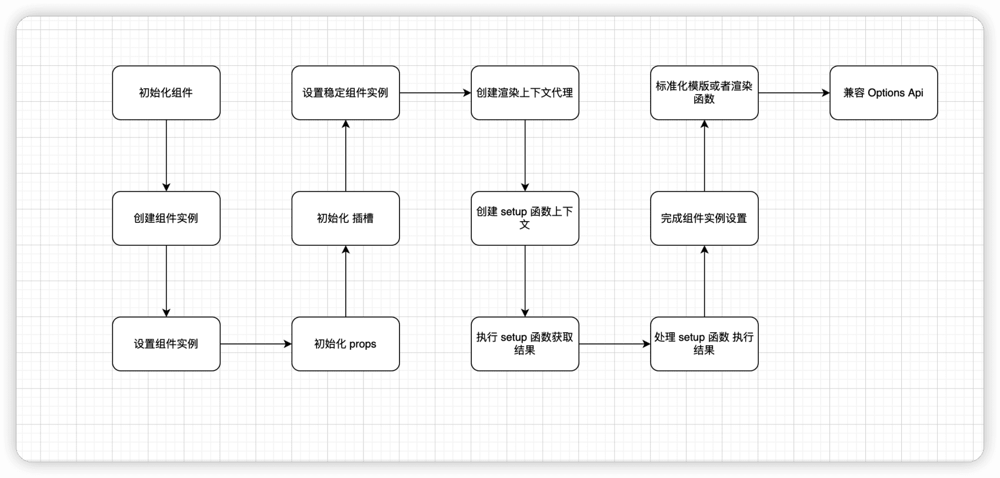

# 组件的实例

## mountComponent

* 渲染 vnode 和 生成 DOM 流程主要是通过 mountComponent 函数来完成的
* mountComponent 主要就是  
* 创建组件实例
* 设置组件实例
* 设置并运行带有副作用的渲染函数

## 创建组件实例

### 为什么要创建组件实例？

* 整个渲染过程中 要维护组件的上下文数据
* 组件渲染需要的 props 数据 data 数据 组件 vnode 节点 render 函数一系列声明周期函数 等等
* 我们要把这些数据和函数都挂载到一个对象上
* 后续就可以通过对象访问  对象就是组件的实例
* vue 是通过 createComponentInstance 创建的组件实例

```ts
export function createComponentInstance(
  vnode: VNode,
  parent: ComponentInternalInstance | null,
  suspense: SuspenseBoundary | null
) {
  const type = vnode.type as ConcreteComponent
  // inherit parent app context - or - if root, adopt from root vnode
  const appContext =
    (parent ? parent.appContext : vnode.appContext) || emptyAppContext

  const instance: ComponentInternalInstance = {
    uid: uid++,
    vnode,
    type,
    parent,
    appContext,
    root: null!, // to be immediately set
    next: null,
    subTree: null!, // will be set synchronously right after creation
    effect: null!,
    update: null!, // will be set synchronously right after creation
    scope: new EffectScope(true /* detached */),
    render: null,
    proxy: null,
    exposed: null,
    exposeProxy: null,
    withProxy: null,
    provides: parent ? parent.provides : Object.create(appContext.provides),
    accessCache: null!,
    renderCache: [],

    // local resolved assets
    components: null,
    directives: null,

    // resolved props and emits options
    propsOptions: normalizePropsOptions(type, appContext),
    emitsOptions: normalizeEmitsOptions(type, appContext),

    // emit
    emit: null!, // to be set immediately
    emitted: null,

    // props default value
    propsDefaults: EMPTY_OBJ,

    // inheritAttrs
    inheritAttrs: type.inheritAttrs,

    // state
    ctx: EMPTY_OBJ,
    data: EMPTY_OBJ,
    props: EMPTY_OBJ,
    attrs: EMPTY_OBJ,
    slots: EMPTY_OBJ,
    refs: EMPTY_OBJ,
    setupState: EMPTY_OBJ,
    setupContext: null,

    // suspense related
    suspense,
    suspenseId: suspense ? suspense.pendingId : 0,
    asyncDep: null,
    asyncResolved: false,

    // lifecycle hooks
    // not using enums here because it results in computed properties
    isMounted: false,
    isUnmounted: false,
    isDeactivated: false,
    bc: null,
    c: null,
    bm: null,
    m: null,
    bu: null,
    u: null,
    um: null,
    bum: null,
    da: null,
    a: null,
    rtg: null,
    rtc: null,
    ec: null,
    sp: null
  }
  if (__DEV__) {
    instance.ctx = createDevRenderContext(instance)
  } else {
    instance.ctx = { _: instance }
  }
  instance.root = parent ? parent.root : instance
  instance.emit = emit.bind(null, instance)

  // apply custom element special handling
  if (vnode.ce) {
    vnode.ce(instance)
  }

  return instance
}
```

## 设置组件实例

* 通过 setupComponent 方法实现
* 从组件的 vnode 获取 props children shapeFlag 等属性
* 然后分别对 props 和插槽 进行了初始化
* 如果要设置的是一个有状态组件 会通过 setupStatefulComponent 函数 则要进一步设置有状态组件的实例

```ts
export function setupComponent(
  instance: ComponentInternalInstance,
  isSSR = false
) {
  isInSSRComponentSetup = isSSR

  const { props, children } = instance.vnode
  const isStateful = isStatefulComponent(instance)
  initProps(instance, props, isStateful, isSSR)
  initSlots(instance, children)

  const setupResult = isStateful
    ? setupStatefulComponent(instance, isSSR)
    : undefined
  isInSSRComponentSetup = false
  return setupResult
}
```

### 有状态组件是什么

组件会在渲染过程中把一些状态挂载到组件实例对应的属性上

### setupStatefulComponent

主要做  创建渲染上下文代理  判断处理 setup 函数 完成组件实例的设置

```ts
function setupStatefulComponent(
  instance: ComponentInternalInstance,
  isSSR: boolean
) {
  const Component = instance.type as ComponentOptions

  if (__DEV__) {
    if (Component.name) {
      validateComponentName(Component.name, instance.appContext.config)
    }
    if (Component.components) {
      const names = Object.keys(Component.components)
      for (let i = 0; i < names.length; i++) {
        validateComponentName(names[i], instance.appContext.config)
      }
    }
    if (Component.directives) {
      const names = Object.keys(Component.directives)
      for (let i = 0; i < names.length; i++) {
        validateDirectiveName(names[i])
      }
    }
    if (Component.compilerOptions && isRuntimeOnly()) {
      warn(
        `"compilerOptions" is only supported when using a build of Vue that ` +
          `includes the runtime compiler. Since you are using a runtime-only ` +
          `build, the options should be passed via your build tool config instead.`
      )
    }
  }
  // 0. create render proxy property access cache
  instance.accessCache = Object.create(null)
  // 1. create public instance / render proxy
  // also mark it raw so it's never observed
  instance.proxy = markRaw(new Proxy(instance.ctx, PublicInstanceProxyHandlers))
  if (__DEV__) {
    exposePropsOnRenderContext(instance)
  }
  // 2. call setup()
  const { setup } = Component
  if (setup) {
    const setupContext = (instance.setupContext =
      setup.length > 1 ? createSetupContext(instance) : null)

    setCurrentInstance(instance)
    pauseTracking()
    const setupResult = callWithErrorHandling(
      setup,
      instance,
      ErrorCodes.SETUP_FUNCTION,
      [__DEV__ ? shallowReadonly(instance.props) : instance.props, setupContext]
    )
    resetTracking()
    unsetCurrentInstance()

    if (isPromise(setupResult)) {
      setupResult.then(unsetCurrentInstance, unsetCurrentInstance)
      if (isSSR) {
        // return the promise so server-renderer can wait on it
        return setupResult
          .then((resolvedResult: unknown) => {
            handleSetupResult(instance, resolvedResult, isSSR)
          })
          .catch(e => {
            handleError(e, instance, ErrorCodes.SETUP_FUNCTION)
          })
      } else if (__FEATURE_SUSPENSE__) {
        // async setup returned Promise.
        // bail here and wait for re-entry.
        instance.asyncDep = setupResult
        if (__DEV__ && !instance.suspense) {
          const name = Component.name ?? 'Anonymous'
          warn(
            `Component <${name}>: setup function returned a promise, but no ` +
              `<Suspense> boundary was found in the parent component tree. ` +
              `A component with async setup() must be nested in a <Suspense> ` +
              `in order to be rendered.`
          )
        }
      } else if (__DEV__) {
        warn(
          `setup() returned a Promise, but the version of Vue you are using ` +
            `does not support it yet.`
        )
      }
    } else {
      handleSetupResult(instance, setupResult, isSSR)
    }
  } else {
    finishComponentSetup(instance, isSSR)
  }
}
```

### 创建渲染函数上下文代理

* 主要对 instance.ctx 做代理
* 做代理为了后续 render 函数内部之间访问上下文 instance.ctx 属性

### 上下文代理的优化

* 在解析 SFC 的时候做了一些额外处理
* 来分析组件中返回的绑定数据
* 然后模版编译器就可以捕获这些信息
* 自动转换适当的绑定 之间访问

### 处理 setup 函数

* setupStatefulComponent 中对 setup 函数 主要做了
* 创建 setup 函数上下文
* 执行 setup 函数并获取结果
* 处理 setup 函数的执行结果

## 完成组件实例的设置

* finishComponentSetup 函数 主要
* 标准化模版或者渲染函数
* 兼容 options api
兼容 options api
* 主要是通过 applyOptions 方法实现
* 主要是通过 options api 定义的属性和数据 都添加到组件的实例 instance 相关的属性上
* data 会添加到 instance.data  computed watch provide/inject methods 添加到 instance.ctx
* 对 mixin 和extends 会递归执行 applyOpions 方法完成定义的对象和属性 数据进行合并

```ts
export function finishComponentSetup(
  instance: ComponentInternalInstance,
  isSSR: boolean,
  skipOptions?: boolean
) {
  const Component = instance.type as ComponentOptions

  if (__COMPAT__) {
    convertLegacyRenderFn(instance)

    if (__DEV__ && Component.compatConfig) {
      validateCompatConfig(Component.compatConfig)
    }
  }

  // template / render function normalization
  // could be already set when returned from setup()
  if (!instance.render) {
    // only do on-the-fly compile if not in SSR - SSR on-the-fly compilation
    // is done by server-renderer
    if (!isSSR && compile && !Component.render) {
      const template =
        (__COMPAT__ &&
          instance.vnode.props &&
          instance.vnode.props['inline-template']) ||
        Component.template ||
        resolveMergedOptions(instance).template
      if (template) {
        if (__DEV__) {
          startMeasure(instance, `compile`)
        }
        const { isCustomElement, compilerOptions } = instance.appContext.config
        const { delimiters, compilerOptions: componentCompilerOptions } =
          Component
        const finalCompilerOptions: CompilerOptions = extend(
          extend(
            {
              isCustomElement,
              delimiters
            },
            compilerOptions
          ),
          componentCompilerOptions
        )
        if (__COMPAT__) {
          // pass runtime compat config into the compiler
          finalCompilerOptions.compatConfig = Object.create(globalCompatConfig)
          if (Component.compatConfig) {
            // @ts-expect-error types are not compatible
            extend(finalCompilerOptions.compatConfig, Component.compatConfig)
          }
        }
        Component.render = compile(template, finalCompilerOptions)
        if (__DEV__) {
          endMeasure(instance, `compile`)
        }
      }
    }

    instance.render = (Component.render || NOOP) as InternalRenderFunction

    // for runtime-compiled render functions using `with` blocks, the render
    // proxy used needs a different `has` handler which is more performant and
    // also only allows a whitelist of globals to fallthrough.
    if (installWithProxy) {
      installWithProxy(instance)
    }
  }

  // support for 2.x options
  if (__FEATURE_OPTIONS_API__ && !(__COMPAT__ && skipOptions)) {
    setCurrentInstance(instance)
    pauseTracking()
    applyOptions(instance)
    resetTracking()
    unsetCurrentInstance()
  }

  // warn missing template/render
  // the runtime compilation of template in SSR is done by server-render
  if (__DEV__ && !Component.render && instance.render === NOOP && !isSSR) {
    /*istanbul ignore if*/
    if (!compile && Component.template) {
      warn(
        `Component provided template option but` +
          `runtime compilation is not supported in this build of Vue.` +
          (__ESM_BUNDLER__
            ? `Configure your bundler to alias "vue" to "vue/dist/vue.esm-bundler.js".`
            : __ESM_BROWSER__
            ? `Use "vue.esm-browser.js" instead.`
            : __GLOBAL__
            ? `Use "vue.global.js" instead.`
            : ``) /*should not happen*/
      )
    } else {
      warn(`Component is missing template or render function.`)
    }
  }
}

```

## 组件的初始化流程


## runtime-only  vs  runtime + compiler

### runtime-only

* 体积更小
* 运行时不用编译
* 耗时少 性能优秀

### 区别

是否注册了 compile

## 总结



* 组件的初始化流程主要包含创建组件实例和设置组件实例
* 组件的实例用来维护组件的整个生命周期中的一些上下文数据
* 组件实例设置过程包括创建上下文代理 执行 setup 函数并处理返回结果 标准化渲染函数 以及兼容 Options Api
* 组件的初始化结果 丰富了组件的实例和渲染上下文 后续执行组件的渲染的时候 可以从实例和渲染上下文获取所需数据
