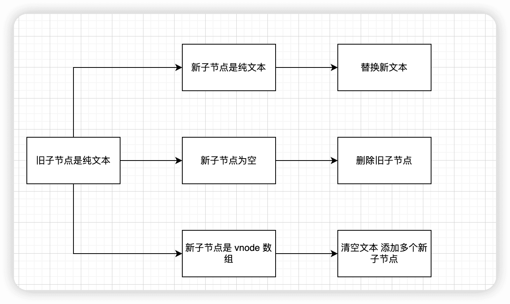
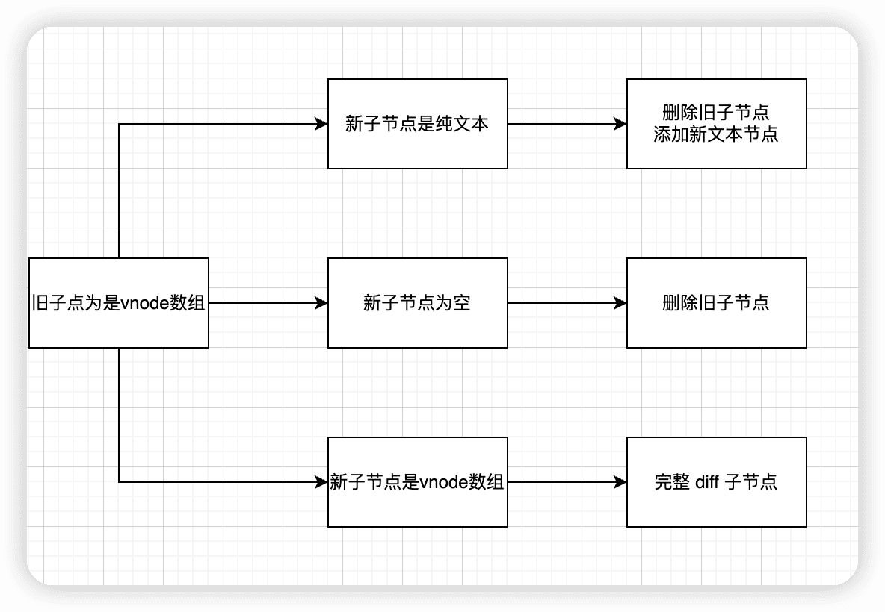

# 组件的渲染流程

## 渲染函数更新组件的过程

### 更新组件主要做了三件事情

1. 更新组件 vnode 节点
2. 渲染新的子树 vnode
3. 根据新旧子树 vnode 执行 patch 逻辑

## patch 流程

首先判断 新旧节点是否相同 vnode 类型 如果不同 则删除旧的节点 再创建新的节点
如果类型相同  则需要进入 diff 更新流程了 然后根据不同的 vnode 类型 执行 不同的逻辑处理

```ts
  const patch: PatchFn = (
    n1,
    n2,
    container,
    anchor = null,
    parentComponent = null,
    parentSuspense = null,
    isSVG = false,
    slotScopeIds = null,
    optimized = __DEV__ && isHmrUpdating ? false : !!n2.dynamicChildren
  ) => {
    if (n1 === n2) {
      return
    }

    // patching & not same type, unmount old tree
    if (n1 && !isSameVNodeType(n1, n2)) {
      anchor = getNextHostNode(n1)
      unmount(n1, parentComponent, parentSuspense, true)
      n1 = null
    }

    if (n2.patchFlag === PatchFlags.BAIL) {
      optimized = false
      n2.dynamicChildren = null
    }

    const { type, ref, shapeFlag } = n2
    switch (type) {
      case Text:
        processText(n1, n2, container, anchor)
        break
      case Comment:
        processCommentNode(n1, n2, container, anchor)
        break
      case Static:
        if (n1 == null) {
          mountStaticNode(n2, container, anchor, isSVG)
        } else if (__DEV__) {
          patchStaticNode(n1, n2, container, isSVG)
        }
        break
      case Fragment:
        processFragment(
          n1,
          n2,
          container,
          anchor,
          parentComponent,
          parentSuspense,
          isSVG,
          slotScopeIds,
          optimized
        )
        break
      default:
        if (shapeFlag & ShapeFlags.ELEMENT) {
          processElement(
            n1,
            n2,
            container,
            anchor,
            parentComponent,
            parentSuspense,
            isSVG,
            slotScopeIds,
            optimized
          )
        } else if (shapeFlag & ShapeFlags.COMPONENT) {
          processComponent(
            n1,
            n2,
            container,
            anchor,
            parentComponent,
            parentSuspense,
            isSVG,
            slotScopeIds,
            optimized
          )
        } else if (shapeFlag & ShapeFlags.TELEPORT) {
          ;(type as typeof TeleportImpl).process(
            n1 as TeleportVNode,
            n2 as TeleportVNode,
            container,
            anchor,
            parentComponent,
            parentSuspense,
            isSVG,
            slotScopeIds,
            optimized,
            internals
          )
        } else if (__FEATURE_SUSPENSE__ && shapeFlag & ShapeFlags.SUSPENSE) {
          ;(type as typeof SuspenseImpl).process(
            n1,
            n2,
            container,
            anchor,
            parentComponent,
            parentSuspense,
            isSVG,
            slotScopeIds,
            optimized,
            internals
          )
        } else if (__DEV__) {
          warn('Invalid VNode type:', type, `(${typeof type})`)
        }
    }

    // set ref
    if (ref != null && parentComponent) {
      setRef(ref, n1 && n1.ref, parentSuspense, n2 || n1, !n2)
    }
  }
```

### 首先处理组件

1. 执行 processComponent 中 再执行 updateComponent 函数来更新子组件  
2. updateComponent 函数在更新子组件的时候 会先执行 shouldUpdateComponent 函数 根据新旧子组件 vnode 判断是否需要更新
3. shouldUpdateComponent 内部 主要通过检测并对比组件的 vnode 中的 props children  dirs 和 transition 等属性 来决定是否更新
4. shouldUpdateComponent 返回 true 会先执行 invalidateJob（instance.update)  
5. 再执行 子组件的副作用函数 instance.update 主动触发子组件的更新

```ts
  const processComponent = (
    n1: VNode | null,
    n2: VNode,
    container: RendererElement,
    anchor: RendererNode | null,
    parentComponent: ComponentInternalInstance | null,
    parentSuspense: SuspenseBoundary | null,
    isSVG: boolean,
    slotScopeIds: string[] | null,
    optimized: boolean
  ) => {
    n2.slotScopeIds = slotScopeIds
    if (n1 == null) {
      if (n2.shapeFlag & ShapeFlags.COMPONENT_KEPT_ALIVE) {
        ;(parentComponent!.ctx as KeepAliveContext).activate(
          n2,
          container,
          anchor,
          isSVG,
          optimized
        )
      } else {
        mountComponent(
          n2,
          container,
          anchor,
          parentComponent,
          parentSuspense,
          isSVG,
          optimized
        )
      }
    } else {
      updateComponent(n1, n2, optimized)
    }
  }
```

```ts
  const updateComponent = (n1: VNode, n2: VNode, optimized: boolean) => {
    const instance = (n2.component = n1.component)!
    if (shouldUpdateComponent(n1, n2, optimized)) {
      if (
        __FEATURE_SUSPENSE__ &&
        instance.asyncDep &&
        !instance.asyncResolved
      ) {
        // async & still pending - just update props and slots
        // since the component's reactive effect for render isn't set-up yet
        if (__DEV__) {
          pushWarningContext(n2)
        }
        updateComponentPreRender(instance, n2, optimized)
        if (__DEV__) {
          popWarningContext()
        }
        return
      } else {
        // normal update
        instance.next = n2
        // in case the child component is also queued, remove it to avoid
        // double updating the same child component in the same flush.
        invalidateJob(instance.update)
        // instance.update is the reactive effect.
        instance.update()
      }
    } else {
      // no update needed. just copy over properties
      n2.el = n1.el
      instance.vnode = n2
    }
  }

```

### 处理普通元素

1. 执行 processElement 逻辑
2. 更新元素的过程中主要做了两件事  更新 props  以及 更新子节点

```ts

  const processElement = (
    n1: VNode | null,
    n2: VNode,
    container: RendererElement,
    anchor: RendererNode | null,
    parentComponent: ComponentInternalInstance | null,
    parentSuspense: SuspenseBoundary | null,
    isSVG: boolean,
    slotScopeIds: string[] | null,
    optimized: boolean
  ) => {
    isSVG = isSVG || (n2.type as string) === 'svg'
    if (n1 == null) {
      mountElement(
        n2,
        container,
        anchor,
        parentComponent,
        parentSuspense,
        isSVG,
        slotScopeIds,
        optimized
      )
    } else {
      patchElement(
        n1,
        n2,
        parentComponent,
        parentSuspense,
        isSVG,
        slotScopeIds,
        optimized
      )
    }
  }

```

### 更新 props

patchProps  函数 会更新 DOM 节点的  class style event 等等其他 dom 属性

```ts
  const patchProps = (
    el: RendererElement,
    vnode: VNode,
    oldProps: Data,
    newProps: Data,
    parentComponent: ComponentInternalInstance | null,
    parentSuspense: SuspenseBoundary | null,
    isSVG: boolean
  ) => {
    if (oldProps !== newProps) {
      if (oldProps !== EMPTY_OBJ) {
        for (const key in oldProps) {
          if (!isReservedProp(key) && !(key in newProps)) {
            hostPatchProp(
              el,
              key,
              oldProps[key],
              null,
              isSVG,
              vnode.children as VNode[],
              parentComponent,
              parentSuspense,
              unmountChildren
            )
          }
        }
      }
      for (const key in newProps) {
        // empty string is not valid prop
        if (isReservedProp(key)) continue
        const next = newProps[key]
        const prev = oldProps[key]
        // defer patching value
        if (next !== prev && key !== 'value') {
          hostPatchProp(
            el,
            key,
            prev,
            next,
            isSVG,
            vnode.children as VNode[],
            parentComponent,
            parentSuspense,
            unmountChildren
          )
        }
      }
      if ('value' in newProps) {
        hostPatchProp(el, 'value', oldProps.value, newProps.value)
      }
    }
  }
```

### 更新子节点

patchChildren 函数

```ts
const patchChildren: PatchChildrenFn = (
    n1,
    n2,
    container,
    anchor,
    parentComponent,
    parentSuspense,
    isSVG,
    slotScopeIds,
    optimized = false
  ) => {
    const c1 = n1 && n1.children
    const prevShapeFlag = n1 ? n1.shapeFlag : 0
    const c2 = n2.children

    const { patchFlag, shapeFlag } = n2
    // fast path
    if (patchFlag > 0) {
      if (patchFlag & PatchFlags.KEYED_FRAGMENT) {
        // this could be either fully-keyed or mixed (some keyed some not)
        // presence of patchFlag means children are guaranteed to be arrays
        patchKeyedChildren(
          c1 as VNode[],
          c2 as VNodeArrayChildren,
          container,
          anchor,
          parentComponent,
          parentSuspense,
          isSVG,
          slotScopeIds,
          optimized
        )
        return
      } else if (patchFlag & PatchFlags.UNKEYED_FRAGMENT) {
        // unkeyed
        patchUnkeyedChildren(
          c1 as VNode[],
          c2 as VNodeArrayChildren,
          container,
          anchor,
          parentComponent,
          parentSuspense,
          isSVG,
          slotScopeIds,
          optimized
        )
        return
      }
    }

    // children has 3 possibilities: text, array or no children.
    if (shapeFlag & ShapeFlags.TEXT_CHILDREN) {
      // text children fast path
      if (prevShapeFlag & ShapeFlags.ARRAY_CHILDREN) {
        unmountChildren(c1 as VNode[], parentComponent, parentSuspense)
      }
      if (c2 !== c1) {
        hostSetElementText(container, c2 as string)
      }
    } else {
      if (prevShapeFlag & ShapeFlags.ARRAY_CHILDREN) {
        // prev children was array
        if (shapeFlag & ShapeFlags.ARRAY_CHILDREN) {
          // two arrays, cannot assume anything, do full diff
          patchKeyedChildren(
            c1 as VNode[],
            c2 as VNodeArrayChildren,
            container,
            anchor,
            parentComponent,
            parentSuspense,
            isSVG,
            slotScopeIds,
            optimized
          )
        } else {
          // no new children, just unmount old
          unmountChildren(c1 as VNode[], parentComponent, parentSuspense, true)
        }
      } else {
        // prev children was text OR null
        // new children is array OR null
        if (prevShapeFlag & ShapeFlags.TEXT_CHILDREN) {
          hostSetElementText(container, '')
        }
        // mount new if array
        if (shapeFlag & ShapeFlags.ARRAY_CHILDREN) {
          mountChildren(
            c2 as VNodeArrayChildren,
            container,
            anchor,
            parentComponent,
            parentSuspense,
            isSVG,
            slotScopeIds,
            optimized
          )
        }
      }
    }
  }

```

元素子节点 vnode 一般会有 三种情况 ： 纯文本  vnode  数组 和空
纯文本


vnode数组


空


## diff 算法

### 同步头部节点

需要维护几个变量

1. 头部的索引 i
2. 旧子节点的尾部索引 e1
3. 新子节点的尾部索引 e2
从头部开始 依次对比新旧节点  如果相同 执行 patch 更新节点
不同或者 索引 i 大于 e1 或 e2 则同步过程结束

### 同步尾部节点

依次对比新旧节点 如果相同 执行 patch 更新节点
不同 或者 索引 i 大于 e1 或e2 则同步过程结束

### 处理完 头部尾部节点 只会剩下三种情况

1. 新子节点有剩余 添加新节点
  a. 如果索引 i 大于 尾部索引 e1 并且小于 e2
  b. 直接挂载新子树丛索引 i 开始 到 索引 e2 部分
2. 旧子节点有剩余 删除多余节点
  a. 如果索引 i 大于 尾部索引 e2
  b. 直接删除旧子树从索引 i 开始到索引 e1 部分到节点
3. 未知子序列
  a. diff

## 总结

1. vue 视图更新粒度是组件级别的
2. patch 过程 递归便利子节点的时候 如果遇到组件的 vnode 会进行一些判断 在满足某些条件的时候会触发子组件的更新
3. 对于普通元素的节点 主要是更新一些属性及其子节点
4. 子节点的更新又分为多种情况 其中 最复杂的情况为数组到数组的更新 要在内部根据不同的情况分成几个 diff 流程
  a. 在需要移动的时候还要求解子节点的最长递增子序列
5. 整个更新过程 利用来 树的深度遍历  通过递归执行 patch 函数 完成整个组件树的更新

