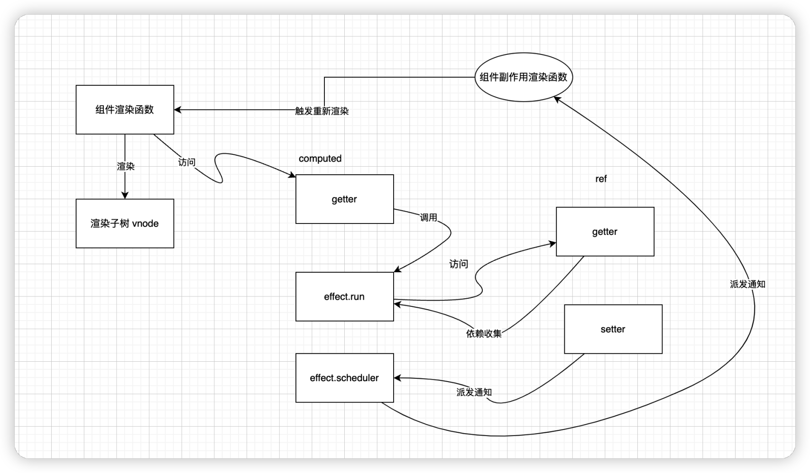

# 计算属性的运行机制

* 计算属性在 template 中也不需要访问 value  因为也拥有了 __v_isRef 属性
* 首先执行 trackRefValue 对计算属性本身进行依赖收集  
  * 这时候 activeEffect 是组件副作用函数对应的 effect 对象
* 会判断 dirty 属性 默认是 true 所以更新的时候会把 _dirtry 设置成 false
  * 接着执行计算属性内部的 effect 对象的 run 函数 进一步执行 computed getter

## 运行机制



## 计算属性的两个特点

### 延时计算

当我们访问计算属性的时候 才会执行  computed getter 函数进行计算

### 缓存

* 内部会缓存上次的计算结果 value  只有 _dirtry 为 true 的时候才会重新计算
* 如果访问计算属性时_dirtry  为 false  直接返回 缓存的 value

```ts
export function computed<T>(
  getter: ComputedGetter<T>,
  debugOptions?: DebuggerOptions
): ComputedRef<T>
export function computed<T>(
  options: WritableComputedOptions<T>,
  debugOptions?: DebuggerOptions
): WritableComputedRef<T>
export function computed<T>(
  getterOrOptions: ComputedGetter<T> | WritableComputedOptions<T>,
  debugOptions?: DebuggerOptions,
  isSSR = false
) {
  let getter: ComputedGetter<T>
  let setter: ComputedSetter<T>

  const onlyGetter = isFunction(getterOrOptions)
  if (onlyGetter) {
    getter = getterOrOptions
    setter = __DEV__
      ? () => {
          console.warn('Write operation failed: computed value is readonly')
        }
      : NOOP
  } else {
    getter = getterOrOptions.get
    setter = getterOrOptions.set
  }

  const cRef = new ComputedRefImpl(getter, setter, onlyGetter || !setter, isSSR)

  if (__DEV__ && debugOptions && !isSSR) {
    cRef.effect.onTrack = debugOptions.onTrack
    cRef.effect.onTrigger = debugOptions.onTrigger
  }

  return cRef as any
}

```
