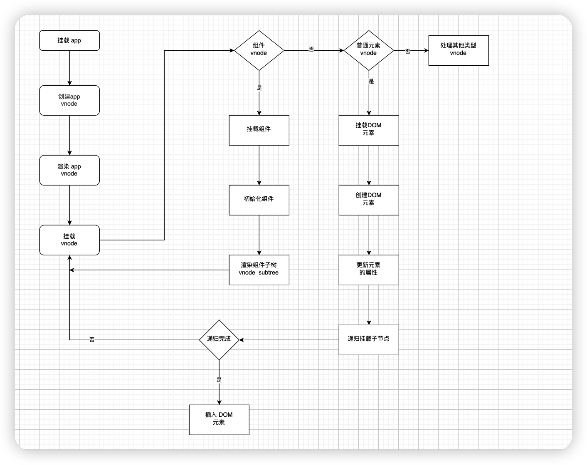

# 组件的初始化流程

## 组件的创建

### 什么是 vnode

1. vnode 本质上是用来描述 DOM 的 Javascript 对象 在 vue 中 可以描述不同类型的节点
2. 比如普通元素节点。组件节点等

## 如何创建 vnode

createBaseVNode

1. 用来创建基础的 vnode 对象
2. 根据传入的参数 创建一个 vnode 对象 可以完整的描述该节点的信息
3. 如果参数 needFullChildrenNormalization 为 true 还会执行 normalizeChildren 去标准化子节点

### createVNode

1. 相比于  createBaseVNode   createVNode 有很多额外的判断
2. 判断 type  是否为空 是否 vnode  是否 class 类型
3. 还会对 style class 执行标准化
4. 最后执行 createBaseVNode 创建 vnode 对象 由于 needFullChildrenNormalization 是 true 创建完 vnode 对象还会执行 normalizeChildren标准化子节点
5. 组件的 template 不能直接使用  必须编译生成 render 函数
6. render 函数内部会执行 createBaseVNode 创建普通元素的 vnode 执行 createVNode 创建组件的 vnode
7. vnode 之间是有父子关系的 createBaseVNode createVNode 第三个参数表示子节点的 vnode
8. 通过父子关系的建立 组件内部的 vnode 实际就构成了一颗 vnode 树 和模版中的 DOM 一一映射

## 组件的挂载

### mountComponent

主要用来创建组件的实例
设置组件的实例
设置并运行带有副作用的渲染函数

#### 主要参数

1. initialVNode 表示组件的 vnode
2. container 组件挂载的父节点
3. anchor 表示挂载的参考锚点
4. parentComponent 父组件的示例

### 应用程序初始化

初始化一个应用程序 需要通过  createApp
createApp 返回的 app 对象已经拥有的 mount 函数 但是会在入口函数中进行重写

#### 为什么要重写？

1. 因为 vue 不仅仅是为了 web 服务 是为了支持 跨平台渲染 createApp的mount 函数是一个标准的可跨平台的组件渲染流程
2. 先创建 vnode  再渲染 vnode
3. 重写的 createApp mount 函数都是与 web 平台相关的

## 总结

* 组件化是 vue 的核心思想之一  允许用模版加对象描述的方式创建组件 再给组件注入不同的数据 就可以渲染组件了
* vnode 本质上是用来描述 DOM 的 Javascript 对象 在 vue 中 可以描述不同类型的节点
  * 引入 vnode 可以把渲染过程抽象化 从而使得 组件的抽象能力得到提升  
  * 也让跨平台能力实现变得更加容易
* 编写的组件会经过编译生成 render 函数  在组件的渲染过程中 会执行 render 函数生成 vnode 节点 在 patch 阶段 把vnode 变成真实的 DOM 挂载在页面
* 在 patch 过程中 如果遇到组件的 vnode 节点 会递归执行组件的渲染  无论组件嵌套的多深 都可以完成整个组件树的渲染
* 应用程序的入口 是 createApp 函数  可以通过他渲染 根组件 进而完成整个应用的渲染 并最终将其挂载到某个 DOM 容器中
渲染流程
