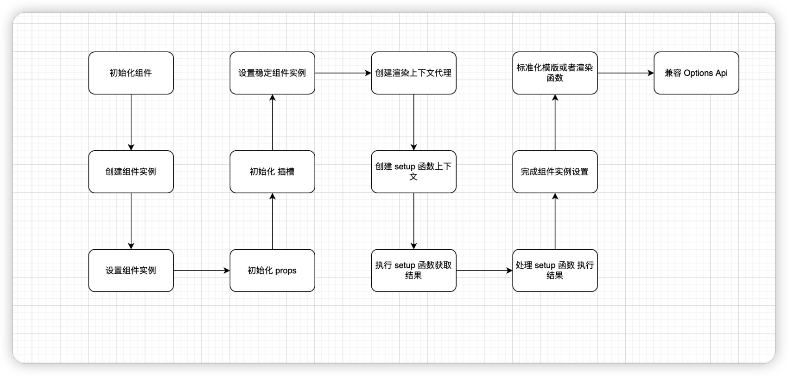

# 组件的实例

## mountComponent

* 渲染 vnode 和 生成 DOM 流程主要是通过 mountComponent 函数来完成的
* mountComponent 主要就是  
* 创建组件实例
* 设置组件实例
* 设置并运行带有副作用的渲染函数

## 创建组件实例

### 为什么要创建组件实例？

* 整个渲染过程中 要维护组件的上下文数据
* 组件渲染需要的 props 数据 data 数据 组件 vnode 节点 render 函数一系列声明周期函数 等等
* 我们要把这些数据和函数都挂载到一个对象上
* 后续就可以通过对象访问  对象就是组件的实例
* vue 是通过 createComponentInstance 创建的组件实例

## 设置组件实例

* 通过 setupComponent 方法实现
* 从组件的 vnode 获取 props children shapeFlag 等属性
* 然后分别对 props 和插槽 进行了初始化
* 如果要设置的是一个有状态组件 会通过 setupStatefullComponet 函数 则要进一步设置有状态组件的实例

### 有状态组件是什么

组件会在渲染过程中把一些状态挂载到组件实例对应的属性上

### setupStatefullComponet

主要做  创建渲染上下文代理  判断处理 setup 函数 完成组件实例的设置

### 创建渲染函数上下文代理

* 主要对 instance.ctx 做代理
* 做代理为了后续 render 函数内部之间访问上下文 instance.ctx 属性

### 上下文代理的优化

* 在解析 SFC 的时候做了一些额外处理
* 来分析组件中返回的绑定数据
* 然后模版编译器就可以捕获这些信息
* 自动转换适当的绑定 之间访问

### 处理 setup 函数

* setupStatefullComponet 中对 setup 函数 主要做了
* 创建 setup 函数上下文
* 执行 setup 函数并获取结果
* 处理 setup 函数的执行结果

## 完成组件实例的设置

* finishComponentSetup 函数 主要
* 标准化模版或者渲染函数
* 兼容 options api
兼容 options api
* 主要是通过 applyOptions 方法实现
* 主要是通过 options api 定义的属性和数据 都添加到组件的实例 instance 相关的属性上
* data 会添加到 instance.data  computed watch provide/inject methods 添加到 instance.ctx
* 对 mixin 和extends 会递归执行 applyOpions 方法完成定义的对象和属性 数据进行合并
组件的初始化流程

## runtime-only  vs  runtime + compiler

### runtime-only

* 体积更小
* 运行时不用编译
* 耗时少 性能优秀

### 区别

是否注册了 compile

## 总结

* 组件的初始化流程主要包含创建组件实例和设置组件实例
* 组件的实例用来维护组件的整个生命周期中的一些上下文数据
* 组件实例设置过程包括创建上下文代理 执行 setup 函数并处理返回结果 标准化渲染函数 以及兼容 Options Api
* 组件的初始化结果 丰富了组件的实例和渲染上下文 后续执行组件的渲染的时候 可以从实例和渲染上下文获取所需数据
